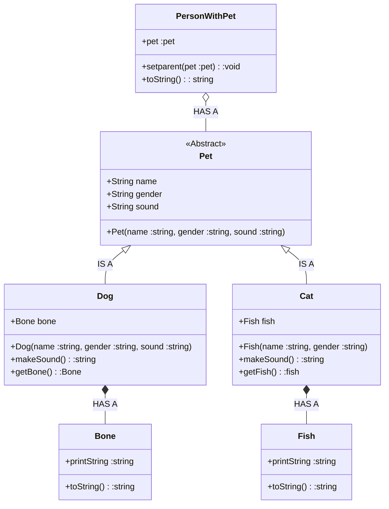

## Relationships
1. **IS-A Relationship:** Whenever one class inherits another class, it is called an IS-A relationship.
2. **HAS-A Relationship:** Whenever an instance of one class is used in another class, it is called HAS-A relationship.



## General Notes
* You should add `public` access modifier to `toString()` method execute the code.
    * `toString()` overrided by the `Object` class.
    * When we don’t use any keyword explicitly, Java will set a default access to a given class, method or property. The default access modifier is also called `package-private`, which means that all members are visible within the same package but aren’t accessible from other packages 
* When you read the code, you don't see any repeating lines. This methodology's name is DRY (Don't Repeat Your Self)
* This code print out these lines:
```
    Person's Pet: Cat@xxxxxxxx
    Person's Pet: Dog@xxxxxxxx
```
* If you want to print Pet's feed, you should add toString() method into the Cat and Pet classes
```java
    // Cat.java
    public String toString(){
        return "Cat with: " + fish.toString();
    }

    // Dog.java
    public String toString(){
        return "Dog with: " + bone.toString();
    }

    // #=> Person's Pet: Cat with: }==*->
    // #=> Person's Pet: Dog with: $==$
```


## Pet.java
```java
/* Abstract classes are similar to interfaces. 
 * You cannot instantiate them, and they may contain a mix of methods declared with or without an implementation. 
 * You can declare fields that are not static and final
 * You can define public, protected, and private concrete methods
 */
abstract class Pet { // BASE CLASS
    // Data fields
    // The default access specifier in Java is used when no access modifier is specified for a class, method, or variable. It is also known as package-private because it restricts access to only within the same package
    String name;
    String gender;
    String sound;

    // Constructor
    Pet(String name, String gender, String sound) {
        // this keyword points related object of Pet
        // If it sound a bit complicated, you can change the parameter names
        // ex: this.name = name_p
        this.name = name;
        this.gender = gender;
        this.sound = sound;
    }

    // Abstract method
    // It must be overrided by the derived class
    abstract String makeSound();
}
```

## Dog.java
```java
// Dog class can reach all data in the Pet class
// It is an example of "Inheritance (IS-A Relationship)"
class Dog extends Pet { // DERIVED CLASS

    // It is an example of "HAS-A Relation"
    // You can access Bone Class' behaviour via bone reference in Dog Class
    Bone bone; 

    // Constructor of Dog class
    Dog(String name, String gender) {
        // It calls the constructor of the Base Class
        // Base Class = Pet Class
        // It equals to Pet(name, gender, "Woof")
        // If we don't call super(), the program throws an error because the Pet class doesn't have a constructor with no parameters. 
        // If Pet class had a constructor with no parameters,  it would be an example of overloading
        // because there would be multiple method with different parameter signs
        super(name, gender, "Woof");

        // It creates a Bone object and assigns to a variable.
        // This variable called as a reference
        // Reference variable is used to point object/values
        // It is similar to "pointer"
        bone = new Bone();
    }

    // As a best practice, we can add the @Override tag to the top of this method to emphasize overriding. 
    // It can be like that:
    // void makeSound(){
    //     System.out.println("Woof")   
    // }
    @Override
    String makeSound() {
        return "Woof";
    }

    // This is an example of Encapsulation
    // Encapsulation is defined as the wrapping up of data under a single unit. 
    // It is the mechanism that binds together code and the data it manipulates.
    // We can manipulate the bone data
    Bone getBone() {
        return bone;
    }
}
```

## Cat.java
```java
// Cat class can reach all data in the Pet class
// It is an example of "Inheritance (IS-A Relationship)"
class Cat extends Pet { // DERIVED CLASS

    // It is an example of "HAS-A Relation"
    // You can access Fİsh Class' behaviour via fish reference in Cat Class
    Fish fish;

    // Constructor of Cat class
    Cat(String name, String gender) {
        // It calls the constructor of the Base Class
        // Base Class = Pet Class
        // It equals to Pet(name, gender, "Woof")
        // If we don't call super(), the program throws an error because the Pet class doesn't have a constructor with no parameters.
        // If Pet class had a constructor with no parameters,  it would be an example of overloading
        // because there would be multiple method with different parameter signs
        super(name, gender, "Meow");

        // It creates a Bone object and assigns to a variable.
        // This variable called as a reference
        // Reference variable is used to point object/values
        // It is similar to "pointer"
        fish = new Fish();
    }

    // As a best practice, we can add the @override tag to the top of this method to emphasize overriding.
    // It can be like that:
    // void makeSound(){
    //     System.out.println("Woof")   
    // } 
    @Override
    String makeSound() {
        return "Meow";
    }

    // This is an example of Encapsulation
    // Encapsulation is defined as the wrapping up of data under a single unit. 
    // It is the mechanism that binds together code and the data it manipulates.
    // We can manipulate the fish data
    Fish getFish() {
        return fish;
    }
}
```

## Bone.java
```java
class Bone {
    String printString = "$==$";

    // Bone overrides the toString() method from the Java Object Class
    public String toString() {
        return printString;
    }
}
```

## Fish.java
```java
class Fish {
    String printString = "}==*->";

    // Fish overrides the toString() method from the Java Object Class
    public String toString() {
        return printString;
    }
}
```

## PersonWithAPet.java
```java
class PersonWithAPet {

    // It is an example of "HAS-A Relation"
    // You can access Pet Class' behaviour via pet reference in PersonWithAPet Class
    Pet pet;

    // This is an example of Encapsulation
    // Encapsulation is defined as the wrapping up of data under a single unit. 
    // It is the mechanism that binds together code and the data it manipulates.
    // We can add validation rules in this method
    void setPet(Pet pet) {
        this.pet = pet;
    }

    // PersonWithAPet overrides the toString() method from the Java Object Class
    public String toString() {
        return "Person's Pet: " + pet.toString();
    }
}
```

## Main.java
```java
class Main {

    // A Java program needs to start its execution somewhere. 
    // A Java program starts by executing the main method of some class. 
    // You can choose the name of the class to execute, but not the name of the method. 
    public static void main(String[] args) {

        // Create a cat object with name: Whiskers, gender: Female
        // cat is the reference variable and points the created object
        // You can use a Pet reference variable (Polymorphism):
        // #=> Pet pet = new Cat("Whiskers", "Female"); 
        Cat cat = new Cat("Whiskers", "Female");

        // Create a dog object with name: Buddy, gender: Male
        // dog is the reference variable and points the created object
        // You can use a Pet reference variable (Polymorphism):
        // #=> Pet pet = new Dog("Buddy", "Male"); 
        Dog dog = new Dog("Buddy", "Male");

        // Create person objects
        PersonWithAPet person1 = new PersonWithAPet();
        PersonWithAPet person2 = new PersonWithAPet();

        // Assign a pet to people
        // setParet() method must be called from the reference variable because it is a instance method
        person1.setPet(cat);
        person2.setPet(dog);

        // If you don't want to use System keyword, you can add this line top of the code
        // import static java.lang.System.*;
        System.out.println(person1); // #=> Person's Pet: Cat@xxxxxxxx
        System.out.println(person2); // #=> Person's Pet: Dog@xxxxxxxx
    }
}
```