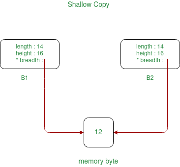
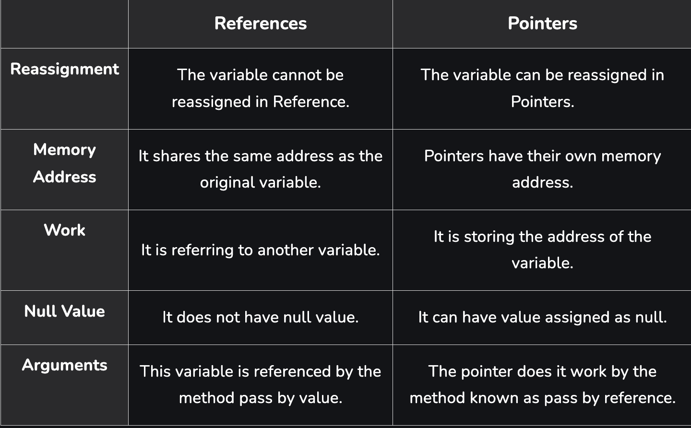

# C++ and Java

## Question 1
Show usage of the * operator:

1. Declare a "pointer"
2. De-reference that pointer

## Answer 1

Resources:

* [Brown University - Memory Management](https://cs.brown.edu/courses/cs149/handouts/javatoc.shtml#MemoryManagement)

* [C++ Dereference](https://www.w3schools.com/cpp/cpp_pointers_dereference.asp)

### Pointer

A pointer, is a variable that stores the memory address as its value.


### Dereference

You can get the value of the pointer variable, by using the * operator (the dereference operator)


### Code Example


```cpp
#include <iostream>

int main() {
  // Declare an integer
  int number = 10;

  // Declare an integer pointer
  // Assign address of number
  int *pnumber = &number;
  
  printf("Address of the pointer: %p\n", &pnumber);

  printf("Pointer holds that address: %p\n", pnumber);
  
  // Dereferencing
  printf("Value of address that halded by the pointer: %d\n", *pnumber);
}
```

### Expected Output

```yaml
Address of the pointer: 0x7ffc04704cf0
Pointer holds that address: 0x7ffc04704cfc
Value of address that halded by the pointer: 10
```

### Code Example 2


```cpp
#include <iostream>

int main() {
  // Declare an integer
  int number = 10;

  // Declare an integer pointer
  // Assign address of number
  int *pnumber = &number;
   
  // Dereferencing
  int number2 = *pnumber;

  // They are independent
  number2 = number2 + 5;
  *pnumber = *pnumber + 20;

  printf("%d\n", number2);
  printf("%d\n", *pnumber);
}
```

### Expected Output
```yaml
Number2..: 15
*pnumber..: 30
```

## Question 2

Show usage of the & operator:

1. As a reference
2. As an address of operator

## Answer 2

Resources:

* [Brown University - Memory Management](https://cs.brown.edu/courses/cs149/handouts/javatoc.shtml#MemoryManagement)

* [C++ References](https://www.w3schools.com/cpp/cpp_references.asp)

* [C++ Memory Address](https://www.w3schools.com/cpp/cpp_references_memory.asp)

### Usage 1: As a reference

Suppose you allocate a chunk of memory for an object. Sometimes, it may be useful to refer to this block of memory with more than one name. We can sort of already do this with pointers, since multiple pointers can point to the same object. There is also a way to do it without using pointers; we can use something called references instead.

```cpp
#include <stdio.h>

int main(int argc, char **argv) {
    // Declare an integer variable    
    int foo = 10;

    // Declare a reference variable
    // By assigning foo to bar, 
    // bar does not become a copy of foo, 
    // but instead refers to the same memory location as foo.
    int& bar = foo;

    // When you change the value of bar, it alsochanges the value of foo
    bar += 10;
    printf("foo is: %d\n", foo);
    printf("bar is: %d\n", bar);
}
```

Output:
```yaml
foo is: 20
bar is: 20
```

### Usage 2: As an address of operator

It can also be used to get the memory address of a variable; which is the location of where the variable is stored on the computer.

```cpp
#include <iostream>

int main() {
  // Declare an integer
  int number = 10;
  
  // Assign address of number to pnumber  
  int *pnumber = &number;

  printf("pnumber points: %p\n", pnumber);
  printf("value of the ram slot that pointed by pnumber: %d\n", *pnumber);
  
  // Print address of the pnumber
  printf("address of pnumber: %p\n", &pnumber);
   
}
```

Output:
```yaml
pnumber points: 0x7fffe14f8dfc
value of the ram slot that pointed by pnumber: 10
address of pnumber: 0x7fffe14f8df0
```

## Question 3

Explaining the difference between a pointer and a reference in C++

## Answer 3

### Resources:

* [Pointers vs References in C++](https://www.geeksforgeeks.org/pointers-vs-references-cpp/)

* [C++ Arrays](https://www.w3schools.com/cpp/cpp_arrays.asp)

* [C++ Pointer Arithmetic](https://www.geeksforgeeks.org/cpp-pointer-arithmetic/)

<hr>

### Definitions

<b>Pointers:</b> A pointer is a variable that holds the memory address of another variable.

<b>References:</b> A reference variable is an alias, that is, another name for an already existing variable.

### Differences

1. Declarations

```cpp
int i = 3; 

// A pointer to variable i or "stores the address of i"
int *ptr = &i; 

// A reference (or alias) for i.
int &ref = i; 
```
<hr>

2. Reassignment: 
  * A pointer can be re-assigned.

  ```cpp
  // Create integers
  int a = 5;
  int b = 6;

  // Create an integer pointer
  int *p;

  // First assignment
  p = &a;

  // Second assignment
  p = &b;
  ```

  *  A reference cannot be re-assigned, and must be assigned at initialization.
  
  ```cpp
  int a = 5;
  int b = 6;
  int &p = a;
  
  // This will throw an error of "multiple declaration is not allowed"
  int &p = b; 
  ```

  <hr>

  3. Memory Address: A pointer has its own memory address and size on the stack, whereas a reference shares the same memory address with the original variable and takes up no space on the stack.

```cpp
#include <iostream>

int main() {
  int number = 10;
  int *ptr = &number;
  int &ref = number;

  // Address of number
  printf("Address of number..: %p \n", &number);
  
  // Pointer has different address than number
  printf("Address of pointer..: %p \n", &ptr);

  // Reference has same address with number
  printf("Address of reference..: %p \n", &ref);
}
```

Output:
```yaml
Address of number..: 0x7fff45da1b54 
Address of pointer..: 0x7fff45da1b48 
Address of reference..: 0x7fff45da1b54 
```

<hr>

4. Indirection:  You can have a pointer to pointer (known as a double pointer) offering extra levels of indirection, whereas references only offer one level of indirection.

```cpp
// Two pointer - Valid
#include <iostream>

int main() {
  int number = 10;
  int *ptr = &number;
  int **ptr2 = &ptr;
}
```

```cpp
// Two references - Invalid
#include <iostream>

int main() {
  int number = 10;
  int &ptr = number;
  int &&ptr2 = &ptr;
}
```

<hr>

5. Arithmetic operations: Various arithmetic operations can be performed on pointers, whereas there is no such thing called Reference Arithmetic (however, you can perform pointer arithmetic on the address of an object pointed to by a reference, as in &obj + 5). 

```cpp
#include <iostream>

int main() {
  // Define array
  int arr[3] = {10,20,30};

  // Pointer points first item of the array
  int *ptr = &arr[0];

  // First item value and address
  printf("Value of the ptr..: %d \n", *ptr);
  printf("Address of the ptr..: %p \n", &ptr);

  // Increment pointer 4 bytes
  ptr = ptr + 1; 

  // Second item value and address
  printf("Value of the ptr..: %d \n", *ptr);
  printf("Address of the ptr..: %p \n", &ptr);

  // Increment pointer 4 bytes
  ptr = ptr + 1;

  // Thirth item value and address
  printf("Value of the ptr..: %d \n", *ptr);
  printf("Address of the ptr..: %p \n", &ptr);
  
}
```

### Summary

Use references: 
* In function parameters and return types.

Use pointers: 
* If pointer arithmetic or passing a NULL pointer is needed. For example, for arrays (Note that accessing an array is implemented using pointer arithmetic).

* To implement data structures like a linked list, a tree, etc. and their algorithms. This is so because, in order to point to different cells, we have to use the concept of pointers.

