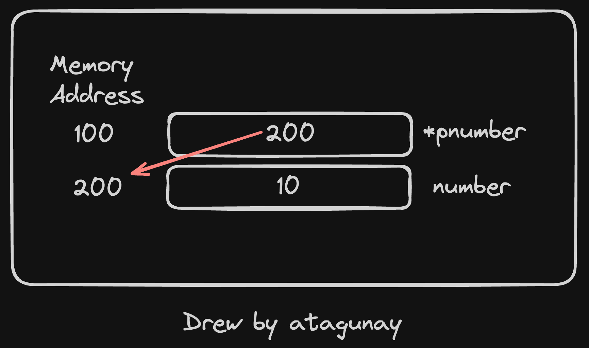

# C++ and Java

## Question 1
Show usage of the * operator:

1. Declare a "pointer"
2. De-reference that pointer

## Answer 1

Resources:

* [Brown University - Memory Management](https://cs.brown.edu/courses/cs149/handouts/javatoc.shtml#MemoryManagement)

* [C++ Dereference](https://www.w3schools.com/cpp/cpp_pointers_dereference.asp)

### Pointer

A pointer, is a variable that stores the memory address as its value.


### Dereference

You can get the value of the pointer variable, by using the * operator (the dereference operator)


### Code Example



```cpp
#include <iostream>

int main() {
  // Declare an integer
  int number = 10;

  // Declare an integer pointer
  // Assign address of number
  int *pnumber = &number;
  
  printf("Address of the pointer: %p\n", &pnumber);

  printf("Pointer holds that address: %p\n", pnumber);
  
  // Dereferencing
  printf("Value of address that halded by the pointer: %d\n", *pnumber);
}
```

### Expected Output

```yaml
Address of the pointer: 0x7ffc04704cf0
Pointer holds that address: 0x7ffc04704cfc
Value of address that halded by the pointer: 10
```

### Code Example 2


```cpp
#include <iostream>

int main() {
  // Declare an integer
  int number = 10;

  // Declare an integer pointer
  // Assign address of number
  int *pnumber = &number;
   
  // Dereferencing
  int number2 = *pnumber;

  // They are independent
  number2 = number2 + 5;
  *pnumber = *pnumber + 20;

  printf("%d\n", number2);
  printf("%d\n", *pnumber);
}
```

### Expected Output
```yaml
Number2..: 15
*pnumber..: 30
```

## Question 2

Show usage of the & operator:

1. As a reference
2. As an address of operator

## Answer 2

Resources:

* [Brown University - Memory Management](https://cs.brown.edu/courses/cs149/handouts/javatoc.shtml#MemoryManagement)

* [C++ References](https://www.w3schools.com/cpp/cpp_references.asp)

* [C++ Memory Address](https://www.w3schools.com/cpp/cpp_references_memory.asp)

### Usage 1: As a reference

Suppose you allocate a chunk of memory for an object. Sometimes, it may be useful to refer to this block of memory with more than one name. We can sort of already do this with pointers, since multiple pointers can point to the same object. There is also a way to do it without using pointers; we can use something called references instead.

```cpp
#include <stdio.h>

int main(int argc, char **argv) {
    // Declare an integer variable    
    int foo = 10;

    // Declare a reference variable
    // By assigning foo to bar, 
    // bar does not become a copy of foo, 
    // but instead refers to the same memory location as foo.
    int& bar = foo;

    // When you change the value of bar, it alsochanges the value of foo
    bar += 10;
    printf("foo is: %d\n", foo);
    printf("bar is: %d\n", bar);
}
```

Output:
```yaml
foo is: 20
bar is: 20
```

### Usage 2: As an address of operator

It can also be used to get the memory address of a variable; which is the location of where the variable is stored on the computer.

```cpp
#include <iostream>

int main() {
  // Declare an integer
  int number = 10;
  
  // Assign address of number to pnumber  
  int *pnumber = &number;

  printf("pnumber points: %p\n", pnumber);
  printf("value of the ram slot that pointed by pnumber: %d\n", *pnumber);
  
  // Print address of the pnumber
  printf("address of pnumber: %p\n", &pnumber);
   
}
```

Output:
```yaml
pnumber points: 0x7fffe14f8dfc
value of the ram slot that pointed by pnumber: 10
address of pnumber: 0x7fffe14f8df0
```
