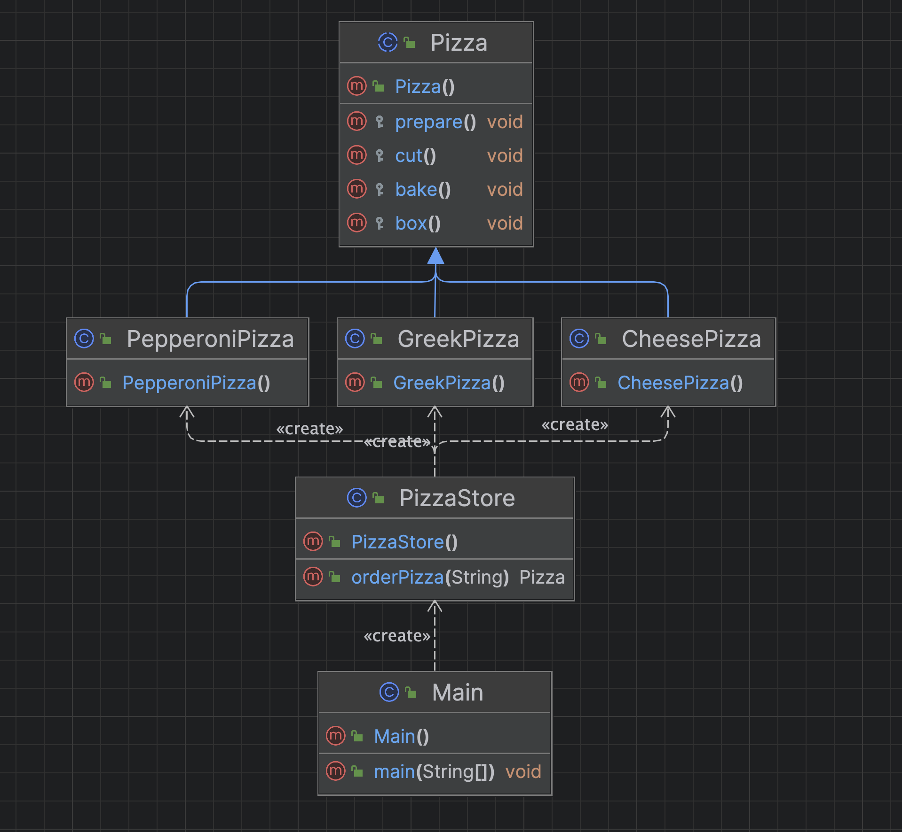

## Pain Point: Unable for Open-Closed Principle

### References: 
* Head First Design Patterns Book
    * Page: 110-114

<hr>

Let’s say you have a pizza store

```java
/*
    This code is NOT closed for modification.
    If the Pizza Shop changes its pizza offerings, we have to get into this code and modify it.

    For EX: remove the greek pizza
 */

public class PizzaStore {
    public Pizza orderPizza(String type) {
        Pizza pizza = null;

        // Based on the type of pizza, we instantiate the correct concrete class and assign it to the pizza instance variable.
        // Note that each pizza here has to implement the Pizza interface.
        switch (type) {
            case "cheese" -> pizza = new CheesePizza();
            case "greek" -> pizza = new GreekPizza();
            case "pepperoni" -> pizza = new PepperoniPizza();
        }

        pizza.prepare();
        pizza.bake();
        pizza.cut();
        pizza.box();

        return pizza;
    }
}

```

This code is NOT closed for modification. If the Pizza Shop changes its pizza offerings, we have to get into this code and modify it.

### Full Implementation
* https://replit.com/@AtaGunay/PaintPointFactoryDesignPattern

### Full Implementation Class Diagram

