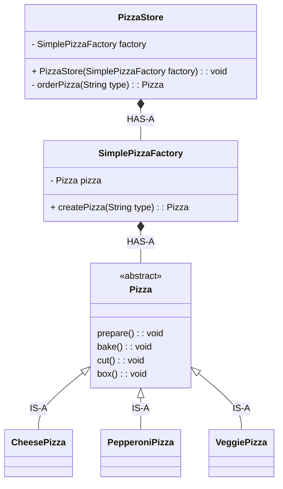
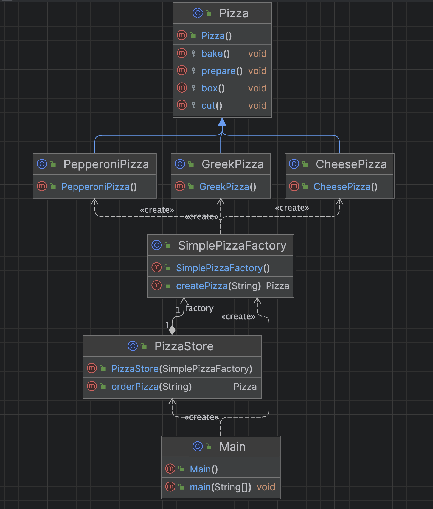

# Simple Factory

### References: 
* Head First Design Patterns Book
    * Page: 115-125

<hr>

## `FIX Pain Point`: Unable for Open-Closed Principle
What we’re going to do is take the creation code and move it out into another object that is only going to be concerned with creating pizzas.


## Simple Factory

Factories handle the details of object creation. Once we have a SimplePizzaFactory, our orderPizza() method just becomes a client of that object. Any time it needs a pizza it asks the pizza factory to make one.

### Class Diagram Of The Simple Factory
<hr>




### Explaination Of the Class Diagram
<hr>


### Parallel Hierarchy


### Implementation Of the Factory Method
<hr>

PizzaStore.java
```java
/*
    This is the client of the factory.
    PizzaStore now goes through the SimplePizzaFactory to get instances of pizza.
 */

public class PizzaStore {
    SimplePizzaFactory factory;

    public PizzaStore(SimplePizzaFactory factory){
        this.factory = factory;
    }

    public Pizza orderPizza(String type) {
        Pizza pizza = null;

        // Encapsulate the pizza selection
        factory.createPizza(type);

        pizza.prepare();
        pizza.bake();
        pizza.cut();
        pizza.box();

        return pizza;
    }
}
```

SimplePizzaFactory.java
```java
/*
    Factories handle the details of object creation.
    Once we have a SimplePizzaFactory, our orderPizza() method just becomes a client of that object.
    Any time it needs a pizza it asks the pizza factory to make one.
 */

/*
    This is the factory where we create pizzas;
    it should be the only part of our application that refers to concrete Pizza classes
 */

public class SimplePizzaFactory {
    public Pizza createPizza(String type){
        Pizza pizza = null;

        switch (type) {
            case "cheese" -> pizza =  new CheesePizza();
            case "greek" -> pizza =  new GreekPizza();
            case "pepperoni" -> pizza = new PepperoniPizza();
        }

        return pizza;
    }
}
```

Main.java
```java
public class Main {
    public static void main(String[] args) {

        /*
            What we’re going to do is take the creation code and
            Move it out into another object that is only going to be concerned with creating pizzas.
         */

        SimplePizzaFactory factory = new SimplePizzaFactory();
        PizzaStore pizzaStore = new PizzaStore(factory);
        pizzaStore.orderPizza("cheese");
    }
}
```

Output
```yml
CheesePizza : preparing
CheesePizza : baking
CheesePizza : cutting
CheesePizza : boxing
```


### Full Implementation
* https://replit.com/@AtaGunay/SimpleFactory

### Full Implementation Class Diagram


###  How to identify this variant of factory as distinct from another?

