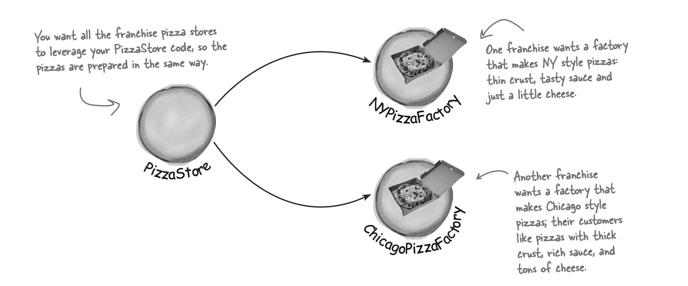
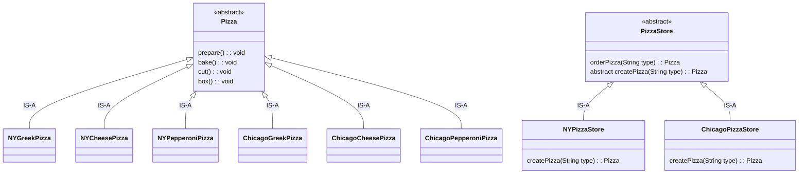
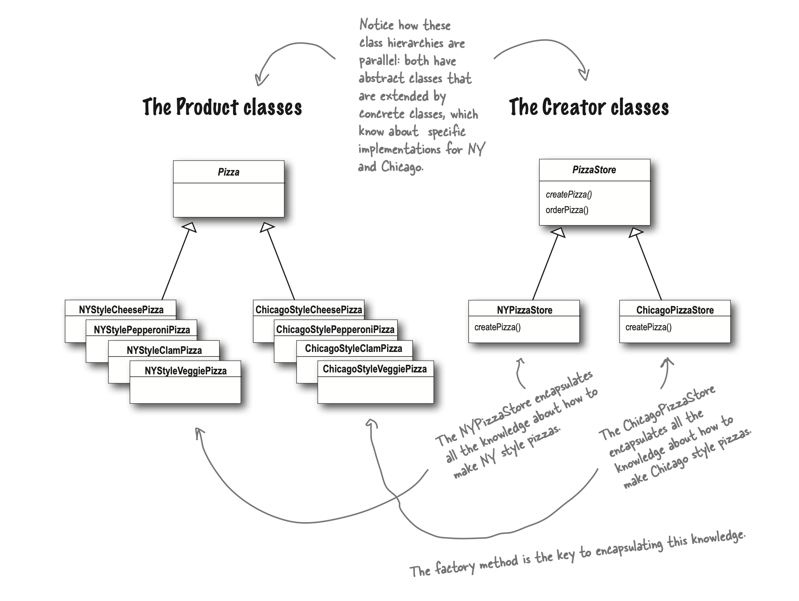
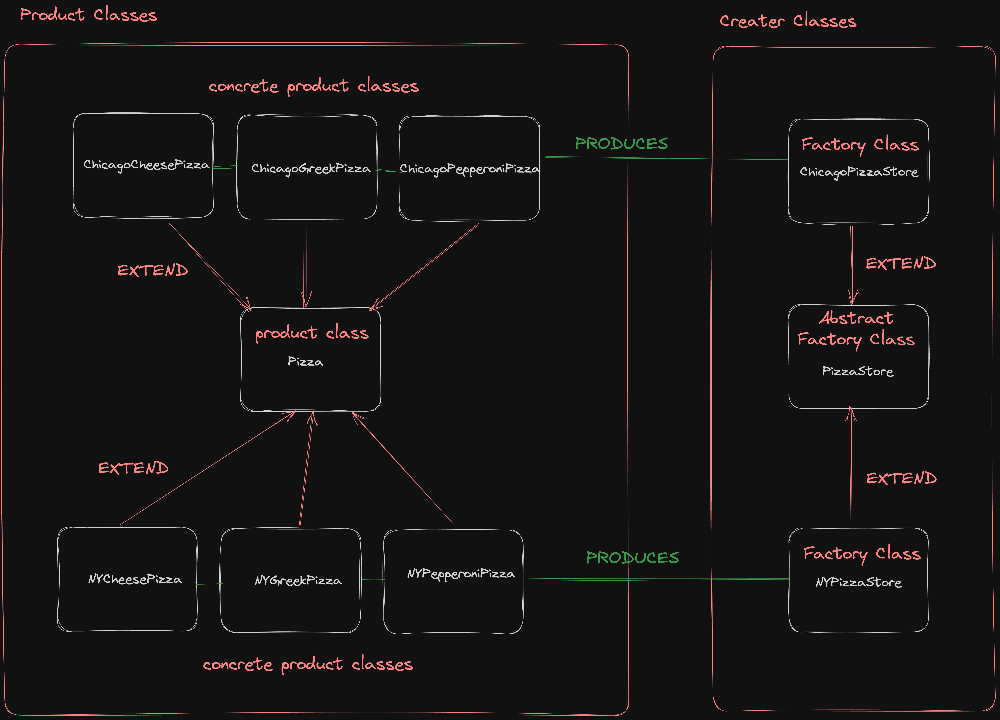
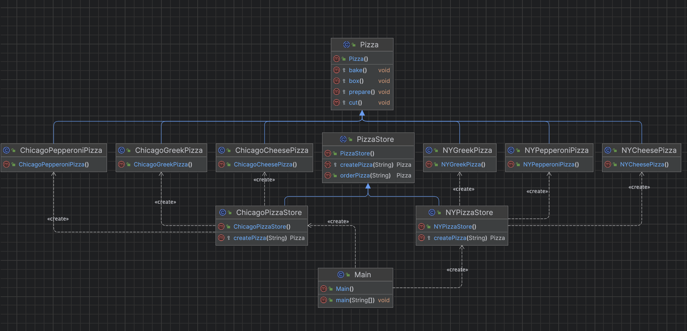

# Factory Method

### References: 
* Head First Design Patterns Book
    * Page: 134-156

<hr>

The Factory Method Pattern defines an interface for creating an object, but lets subclasses decide which class to instantiate. Factory Method lets a class defer instantiation to subclasses.

<hr>

<b>Until now, we have:</b>

* 1 Pizza Product (Pizza.java)
* 3 Pizza Concrete Products (CheesePizza.java, GreekPizza.java ...)
* 1 Pizza Store (PizzaStore.java)
* 1 Pizza Factory (SimplePizzaFactory.java)

<hr>

<b>New Scenerio</b>
* As the franchiser, you want to ensure the quality of the franchise operations and so you want them to use your time-tested code.

* But what about regional differences? Each franchise might want to offer different styles of pizzas (New York, Chicago, and California, to name a few) 



<b>Approach With Simple Factory</b>
<hr>

If we take out SimplePizzaFactory and create three different factories, NYPizzaFactory, ChicagoPizzaFactory and CaliforniaPizzaFactory, then we can just compose the PizzaStore with the appropriate factory and a franchise is good to go

```java
NYPizzaFactory nyFactory = new NYPizzaFactory(); 
PizzaStore nyStore = new PizzaStore(nyFactory); 
nyStore.orderPizza(“Veggie”);

ChicagoPizzaFactory chicagoFactory = new ChicagoPizzaFactory(); PizzaStore chicagoStore = new PizzaStore(chicagoFactory); 
chicagoStore.orderPizza(“Veggie”);
```

But we can use `Factory Method Pattern` because in Simple Factory Approach you can not control the process after the creation because every factory uses own preapre, bake, cut and box methods

## Class Diagram




### Parallel Hierarchy


## Implementation Of Factory Method
PizzaStore.java
```java
/*
    Each subclass overrides the createPizza() method,
    while all subclasses make use of the orderPizza() method defined in PizzaStore.
 */

// This is our abstract creator class.
// It defines an abstract factory method that the subclasses implement to produce products.
public abstract class PizzaStore {
    /*
        orderPizza() is defined in the abstract PizzaStore, not the subclasses.
        So, the method has no idea which subclass is actually running the code and making the pizzas.
     */
    public Pizza orderPizza(String type){

        // Now createPizza is back to being a call to a method in the PizzaStore rather than on a factory object.
        Pizza pizza = createPizza(type);

        pizza.prepare();
        pizza.bake();
        pizza.cut();
        pizza.box();

        return pizza;
    }

    // Our “factory method” is now abstract in PizzaStore.
    // A factory method handles object creation and encapsulates it in a subclass.
    // This decouples the client code in the superclass from the object creation code in the subclass.
    protected abstract Pizza createPizza(String type);
}
```

NYPizzaStore.java
```java
// Factory Class
public class NYPizzaStore extends PizzaStore{

    // createPizza() returns a Pizza, and the subclass is fully responsible for which concrete Pizza it instantiates
    @Override
    protected Pizza createPizza(String type) {

        Pizza pizza = switch (type) {
            case "Cheese" -> new NYCheesePizza();
            case "Greek" -> new NYGreekPizza();
            case "Pepperoni" -> new NYPepperoniPizza();
            default -> null;
        };

        return pizza;
    }
}
```

ChicagoPizzaStore.java
```java
// Factory Class
public class ChicagoPizzaStore extends PizzaStore {
    // createPizza() returns a Pizza, and the subclass is fully responsible for which concrete Pizza it instantiates
    @Override
    protected Pizza createPizza(String type) {
        Pizza pizza = switch (type) {
            case "Cheese" -> new ChicagoCheesePizza();
            case "Greek" -> new ChicagoGreekPizza();
            case "Pepperoni" -> new ChicagoPepperoniPizza();
            default -> null;
        };

        return pizza;
    }
}
```

Main.java
```java
    public class Main {
    public static void main(String[] args) {
        NYPizzaStore NYStore = new NYPizzaStore();
        ChicagoPizzaStore ChicagoStore = new ChicagoPizzaStore();

        NYStore.orderPizza("Cheese");
        ChicagoStore.orderPizza("Pepperoni");
    }
}
```

Output

```yml
NYCheesePizza : preparing
NYCheesePizza : baking
NYCheesePizza : cutting
NYCheesePizza : boxing
ChicagoPepperoniPizza : preparing
ChicagoPepperoniPizza : baking
ChicagoPepperoniPizza : cutting
ChicagoPepperoniPizza : boxing
```

## Full Implementation
* https://replit.com/@AtaGunay/FactoryMethod

## Full Implementation Class Diagram


###  How to identify this variant of factory as distinct from another?