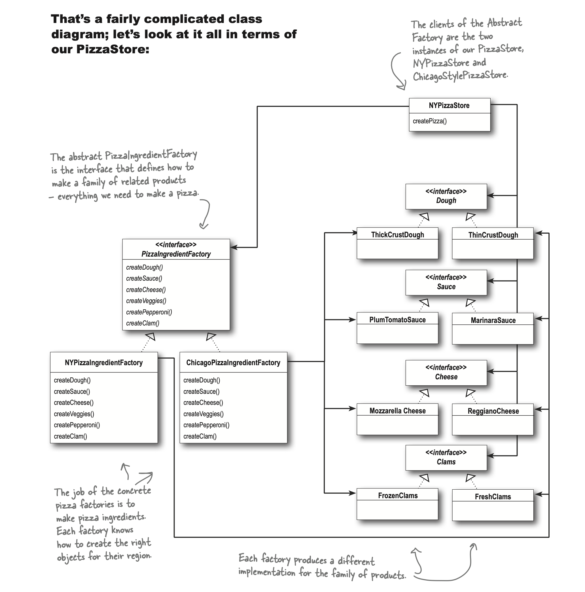
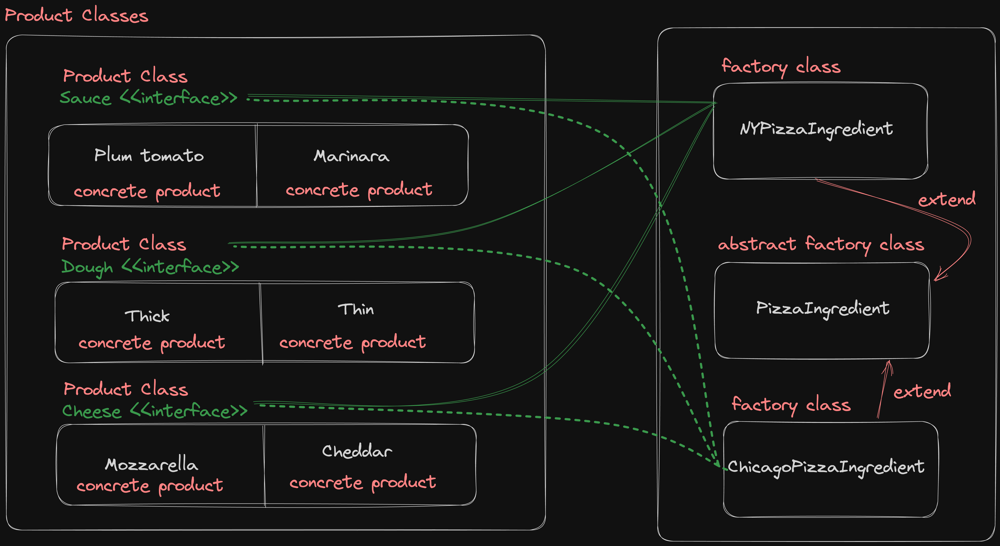
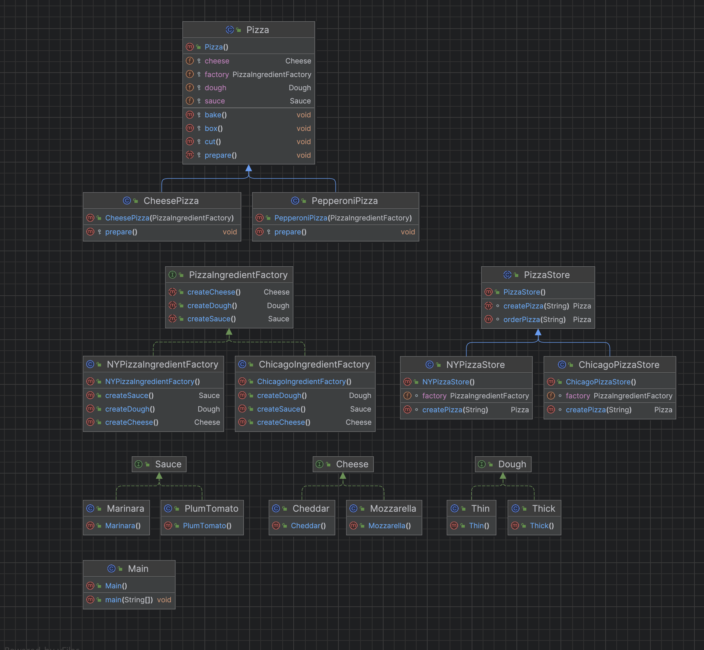

# Abstract Factory

### References: 
* Head First Design Patterns Book
    * Page: 156-162

<hr>


An Abstract Factory gives us an interface for creating a family of products. By writing code that uses this interface, we decouple our code from the actual factory that creates the products.

* All Pizzas are made from the same components, but each region has a different implementation of those components.

* Each family consists of a type of dough, type of sauce, a type of cheese, and seafood topping.

* Methods to create products in an Abstract Factory are often implemented with a Factory Method...

## Abstract Factory Class Diagram


## Parallel Hierarchy


## Implementation Of the Factory Method
Cheese.java

```java
// Product
public interface Cheese {
}
```

Mozzarella.java

```java
// Concrete Product
public class Mozzarella implements Cheese {
}
```

Cheddar.java
```java
// Concrete Product
public class Cheddar implements Cheese {
}
```

PizzaIngredientFactory.java
```java
/*
    An Abstract Factory gives us an interface for creating a family of products.
    By writing code that uses this interface, we decouple our code from the actual factory that creates the products.
 */

// Abstract Factory
public interface PizzaIngredientFactory {
    // For each ingredient we define a create method in our interface.
    Dough createDough();

    Sauce createSauce();

    Cheese createCheese();
}
```

NYPizzaIngredientFactory.java
```java
// For each ingredient in the ingredient family, we create the New York version.
// Concrete Factory
public class NYPizzaIngredientFactory implements PizzaIngredientFactory {

    @Override
    public Dough createDough() {
        return new Thin();
    }

    @Override
    public Sauce createSauce() {
        return new Marinara();
    }

    @Override
    public Cheese createCheese() {
        return new Cheddar();
    }
}
```

PizzaStore.java

```java
public abstract class PizzaStore {
    Pizza orderPizza(String type) {
        Pizza pizza = createPizza(type);

        pizza.prepare();
        pizza.bake();
        pizza.cut();
        pizza.box();

        return pizza;
    }

    abstract Pizza createPizza(String type);
}
```

NYPizzaStore.java

```java
public class NYPizzaStore extends PizzaStore {

    // The NY Store is composed with a NY pizza ingredient factory.
    // This will be used to produce the ingredients for all NY style pizzas.
    PizzaIngredientFactory factory = new NYPizzaIngredientFactory();

    @Override
    Pizza createPizza(String type) {
        Pizza pizza = null;

        if (type.equals("Cheese")) {
            // We now pass each pizza the factory that should be used to produce its ingredients.
            pizza = new CheesePizza(factory);
        } else if (type.equals("Pepperoni")) {
            // We now pass each pizza the factory that should be used to produce its ingredients.
            pizza = new PepperoniPizza(factory);
        }

        return pizza;
    }
}
```

Pizza.java

```java
public abstract class Pizza {
    // Each pizza holds a set of ingredients that are used in its preparation.
    protected PizzaIngredientFactory factory;
    protected Dough dough;
    protected Sauce sauce;
    protected Cheese cheese;

    // We’ve now made the prepare method abstract.
    // This is where we are going to collect the ingredients needed for the pizza,
    // which of course will come from the ingredient factory.
    protected abstract void prepare();

    protected void bake() {
        System.out.println(this.getClass().getName() + " : " + "baking");
    }

    protected void cut() {
        System.out.println(this.getClass().getName() + " : " + "cutting");
    }

    protected void box() {
        System.out.println(this.getClass().getName() + " : " + "boxing");
    }
}
```

CheesePizza.java

```java
public class CheesePizza extends Pizza {
    public CheesePizza(PizzaIngredientFactory factory) {
        this.factory = factory;
    }

    // The prepare() method steps through creating a cheese pizza, and each time it needs an ingredient,
    // it asks the factory to produce it
    @Override
    protected void prepare() {
        System.out.println(this.getClass().getName() + " : " + "preparing");

        // Now, it’s decoupled from the differences in regional ingredients
        dough = factory.createDough();
        sauce = factory.createSauce();
        cheese = factory.createCheese();

        System.out.println("With these ingredients");
        System.out.println(dough.getClass().getName());
        System.out.println(sauce.getClass().getName());
        System.out.println(cheese.getClass().getName());
    }
}
```

Output

```yml
CheesePizza : preparing
With these ingredients
Thin
Marinara
Cheddar
CheesePizza : baking
CheesePizza : cutting
CheesePizza : boxing
-----------------------------
PepperoniPizza : preparing
With these ingredients
Thick
Mozzarella
PepperoniPizza : baking
PepperoniPizza : cutting
PepperoniPizza : boxing
```

## Full Implementation
* https://replit.com/@AtaGunay/AbstractFactory

## Full Implementation Class Diagram


###  How to identify this variant of factory as distinct from another?