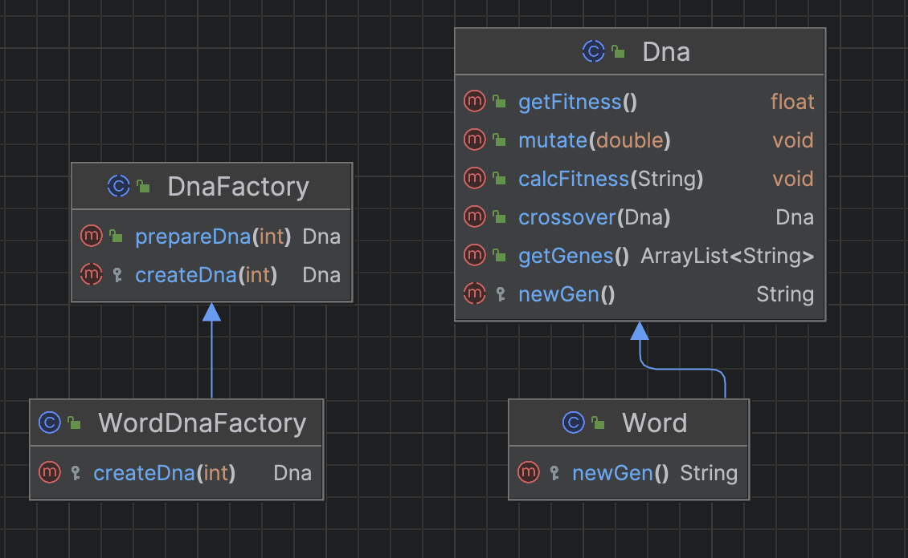

# Implementation Of Factory Design Pattern

* DNA is a general term for genetic algorithm implementations. In my project, I use word objects as a DNA. 

* I can add new DNA types in future. 

    * For example: If I add travel salesman solution in that project DNA will be "road" or "distance"


## Class Diagram
* Dna: Product

* Word: Concrete Product

* DnaFactory: Abstract Factory

* WordDnaFactory: Concrete Factory



## Implementation

```java
// Abstract Factory Class
public abstract class DnaFactory {
    public Dna prepareDna(int genes){
        return createDna(genes);
    }

    // Factory Method
    protected abstract Dna createDna(int genes);
}
```

WordDnaFactory.java
```java
// Concrete factory
public class WordDnaFactory extends DnaFactory {
    @Override
    protected Dna createDna(int genes) {
        return new Word(genes);
    }
}

```

Dna.java
```java
public abstract class Dna {
    protected abstract String newGen();

    // ....
}
```

Word.java

```java
// Concrete Product
public class Word extends Dna {

    // Constructor (makes a random DNA)
    Word(int number) {
        for (int i = 0; i < number; i++) {
            genes.add(newGen());
        }
    }

    @Override
    protected String newGen() {
        int min = 97;   // ASCII number
        int max = 123;  // ASCII number
        int c = rand.nextInt(max - min) + min;

        return Character.toString((char) c);
    }
}
```

Population.java
```java
class Population {
    Population(String target, double mutationRate, int popMax, DnaFactory factory) {
        this.target = target;
        this.mutationRate = mutationRate;
        this.popMax = popMax;

        // Creating populations
        for (int i = 0; i < popMax; i++) {
            populations.add(factory.prepareDna(this.target.length()));
        }
    }

    // ....
}
```

Main.java
```java
class Main {
    public static void main(String[] args) {
        // USAGE OF CLIENT PROGRAMMER
        // Calling constructor
        Population pop = new Population("hello", 0.5, 5, new WordDnaFactory());

        do {
            // Calculate fitness
            pop.calcFitness();

            // Generate mating pool
            pop.naturalSelection();

            //Create next generation
            pop.generate();

            // Print population
            pop.printPopulation();

        } while(!pop.evaluate());
    }
}
```

Output
```yml
// ....

Population:
[g, x, l, s, q]
[u, t, j, l, w]
[d, g, s, c, d]
[p, m, b, l, d]
[h, f, n, z, s]
Population:
[f, e, v, y, y]
[a, a, t, z, z]
[c, e, x, a, y]
[y, a, h, q, p]
[y, g, m, l, l]
Population:
[c, e, q, t, w]
[l, f, c, q, w]
[t, b, l, y, l]
[i, e, c, g, h]
[h, e, l, l, o]
```

## Full Implementation
* https://replit.com/@AtaGunay/Genetic-Algorithm-Example