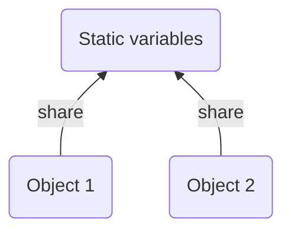

# Singleton Design Pattern

#### Usefull Links
1. https://www.baeldung.com/java-static
2. https://www.baeldung.com/java-stack-heap
3. https://www.digitalocean.com/community/tutorials/java-singleton-design-pattern-best-practices-examples
4. https://www.baeldung.com/java-synchronized
5. https://refactoring.guru/design-patterns/singleton
6. https://stackoverflow.com/questions/6109896/singleton-pattern-bill-pughs-solution

## What is the static keyword and it's effect in Java?
In the Java programming language, the keyword static means that the particular member belongs to a type itself, rather than to an instance of that type.

### Decleration of Instance Variable
```java
ClassName {
    public int variableName = 10;
}
```

### Usage of Instance Variable From The Client Programmer
```java
ClassName instanceName = new ClassName();
// with instance reference
instanceName.variableName; 
```

### Decleration of Static Variable
```java
ClassName {
    public static int variableName = 10;
}
```

### Usage of Static Variable From The Client Programmer
```java
// with class reference
ClassName.variableName; 
```

### 1. The static Fields (Or Class Variables)


* In Java, when we declare a field static, exactly a single copy of that field is created and shared among all instances of that class.
* It doesn’t matter how many times we instantiate a class. There will always be only one copy of static field belonging to it. The value of this static field is shared across all objects of either the same class.

```java
class Duck {
  // static variable
  // Since static variables belong to a class, 
  // we can access them directly using the class name. 
  // So, we don’t need any object reference.
  public static int counter = 0;

  // constructor
  public Duck(){
    // increase counter each time the duck object is created
    counter = counter + 1;
  }
}

class Main {
  public static void main(String[] args) {
    Duck duck_1 = new Duck();
    // counter: 1
    System.out.println("counter: " + Duck.counter);

    Duck duck_2 = new Duck();
    // counter: 2
    System.out.println("counter: " + Duck.counter);

    Duck duck_3 = new Duck();
    // counter: 3
    System.out.println("counter: " + Duck.counter);

    Duck duck_4 = new Duck();
    // counter: 4
    System.out.println("counter: " + Duck.counter);
  }
}
```

* Here are some reasons for when we’d want to use static fields:
    * when the value of the variable is independent of objects
    * when the value is supposed to be shared across all objects

### 2. The static Methods (Or Class Methods)
* Similar to static fields, static methods also belong to a class instead of an object. So, we can call them without creating the object of the class in which they reside.

```java
class Duck {
  // static method
  public static void Quark(){
    System.out.println("Quack Quack !");
  }
}

class Main {
  public static void main(String[] args) {
    // call static method
    Duck.Quark(); // #=> Quack Quack !
  }
}
```

* static methods in Java are resolved at compile time. Since method overriding is part of Runtime Polymorphism, static methods can’t be overridden.

* Access
    * Instance Methods
        * instance methods can directly access both instance methods and instance variables
        * instance methods can also access static variables and static methods directly
    ```java
    class Duck {
        // instance variable
        private String sound = "Quack Quack";

        // static variable
        private static String className = "Duck";

        // instance method
        public String toString(){
            return sound + "-" + className;
        }
    }

    class Main {
        public static void main(String[] args) {
            Duck d = new Duck();
            // #=> Quack Quack-Duck
            System.out.println(d.toString());
        }
    }
    ```
    * Static Methods
        * static methods can access all static variables and other static methods
        * static methods can’t access instance variables and instance methods directly. They need some object reference to do so.
    
    ```java
    class Duck {
        // static variable
        private static String className = "Duck";

        // static method
        public static String intro(){
            return className;
        }
    }

    class Main {
        public static void main(String[] args) {
            System.out.println(Duck.intro());
        }
    }
    ```


### 3. Static Class
* Java allows us to create a class within a class. It provides a way of grouping elements that we’ll only use in one place. This helps to keep our code more organized and readable.

* Nested classes that we declare static are called static nested classes

* Nested classes that are non-static are called inner classes

* The main difference between these two is that the inner classes have access to all members of the enclosing class (including private ones), whereas the static nested classes only have access to static members of the outer class.

```java
public class Singleton  {
    private Singleton() {}

    private static class SingletonHolder {
        public static final Singleton instance = new Singleton();
    }

    public static Singleton getInstance() {
        return SingletonHolder.instance;
    }
}
```


## What is the essential parts of a simple Singleton (non-threaded) in Java?
The Singleton Pattern ensures a class has only one instance, and provides a global point of access to it.

* Full Implementation
    * [Singleton Design Pattern Implementation (Non-Theraded)](https://replit.com/@AtaGunay/Singleton-Design-Pattern-Non-Threaded)

    ```java
    class Singleton {
        // lazy loading
        private static Singleton singleton_instance;

        // private constructor
        private Singleton() {  
        }

        // getter method
        // an example of encapsulation
        public static Singleton getSingletonInstance() {
            if (singleton_instance == null){
                singleton_instance = new Singleton();
            }

            return singleton_instance;
        }
    }

    class Main {
        public static void main(String[] args) {
            Singleton obj_1 = Singleton.getSingletonInstance();
            Singleton obj_2 = Singleton.getSingletonInstance();

            // They have same signature
            System.out.println("obj_1: " + obj_1);
            System.out.println("obj_2: " + obj_2);
        }
    }
    ```

* Essential Parts
    * Private Constructor
    ```java
    // This constructor is declared private.
    // Only Singleton can instantiate this class
    // Private constructor
    private Singleton() {  
    }
    ```
    
    * Encapsulation (Getter Method)
    ```java
    // The getInstance() method gives us a way to instantiate the class and 
    // also to return an instance of it.
    public static Singleton getSingletonInstance() {
        if (singleton_instance == null){
            singleton_instance = new Singleton();
        }

        return singleton_instance;
    }
    ```

    * Static Variable
    ```java
    // We have a static variable to hold our one instance of the class Singleton.
    private static Singleton singleton_instance;
    ```

    * Static Method
    ```java
    // We can call static methods directly
    // Singleton.getSingletonInstance();
    public static Singleton getSingletonInstance() {
        if (singleton_instance == null){
            singleton_instance = new Singleton();
        }

        return singleton_instance;
    }
    ```

    * Lazy Loading
    ```java
    // if we never need the instance, it never gets created. 
    // This is lazy instantiation
    if (singleton_instance == null){
            singleton_instance = new Singleton();
        }
    ```

##  `Eager` Initialisation Vs `Lazy` Initialisation

### Singleton With Eager Loading

Using this approach, we rely on the JVM to create the unique instance of the Singleton when the class is loaded. The JVM guarantees that the instance will be created before any thread accesses the static uniqueInstance variable.

```java
class Singleton {
    // Eager Loading
    private static Singleton singleton_instance = new Singleton();

    // private constructor
    private Singleton() {  
    }

    public static Singleton getSingletonInstance() {
        // No need to null control
        return singleton_instance;
    }
}
```

### Singleton With Lazy Loading
```java
class Singleton {
    // lazy loading
    private static Singleton singleton_instance;

    // private constructor
    private Singleton() {  
    }

    public static Singleton getSingletonInstance() {
        if (singleton_instance == null){
            singleton_instance = new Singleton();
        }

        return singleton_instance;
    }
}
```

### Opinion
If your application always creates and uses an instance of the Singleton or the overhead of creation and runtime aspects of the Singleton are not onerous, you may want to create your Singleton eagerly. Also, eager loading is guaranteed to be thread safe!

### Multi Thread Problem


## Approach 1: Using `synchronized` Block
```java
class Singleton {
    private static Singleton singleton_instance;

    private Singleton() {  
    }

    // By adding the synchronized keyword , 
    // we force every thread to wait its turn before it can enter the method. 
    // That is, no two threads may enter the method at the same time.
    public static synchronized Singleton getSingletonInstance() {
        if (singleton_instance == null){
            singleton_instance = new Singleton();
        }

        return singleton_instance;
    }
}
```
The onlyn time synchronization is relevant is the first time through this method. In other words, once we’ve set the singleton_instance variable to an instance of Singleton, we have no further need to synchronize this method. After the first time through, synchronization is totally unneeded overhead!

## Approach 2: Using `Double Checked Locking` Block
With double-checked locking, we first check to see if an instance is created, and if not, THEN we synchronize. This way, we only synchronize the first time through.

```java
    class Singleton {
        // The volatile keyword ensures that multiple threads
        // handle the uniqueInstance variable correctly when 
        // it is being initialized to the Singleton instance.
        private volatile static Singleton singleton_instance;

        private Singleton() {  
        }

        public static Singleton getSingletonInstance() {
            // Check for an instance and if there isn’t one, enter a synchronized block.
            if (singleton_instance == null){
                // We only synchronize the first time through!
                synchronized (Singleton.class)
                // Once in the block, check again and if still null create an instance
                if (singleton_instance == null){
                    singleton_instance = new Singleton();
                }
            }

            return singleton_instance;
        }
    }
```

## Approach 3: Using `Bill Pugh Method`
private inner static class that contains the instance of the singleton class. When the singleton class is loaded, SingletonHelper class is not loaded into memory and only when someone calls the getInstance() method, this class gets loaded and creates the singleton class instance. This is the most widely used approach for the singleton class as it doesn’t require synchronization.

```java
public class Singleton {
    // private constructor
    private Singleton(){}

    // inner static class
    // static nested classes behave exactly like any other top-level class,
    // but are enclosed in the only class that will access it, 
    // to provide better packaging convenience.

    // if a nested class doesn’t require any access to its enclosing class instance members, 
    // it’s better to declare it as static. 
    // This way, it won’t be coupled to the outer class and is therefore more optimal, 
    // as they won’t require any heap or stack memory.
    private static class SingletonHelper {
        private static final Singleton INSTANCE = new Singleton();
    }

    public static Singleton getInstance() {
        return SingletonHelper.INSTANCE;
    }
}
```