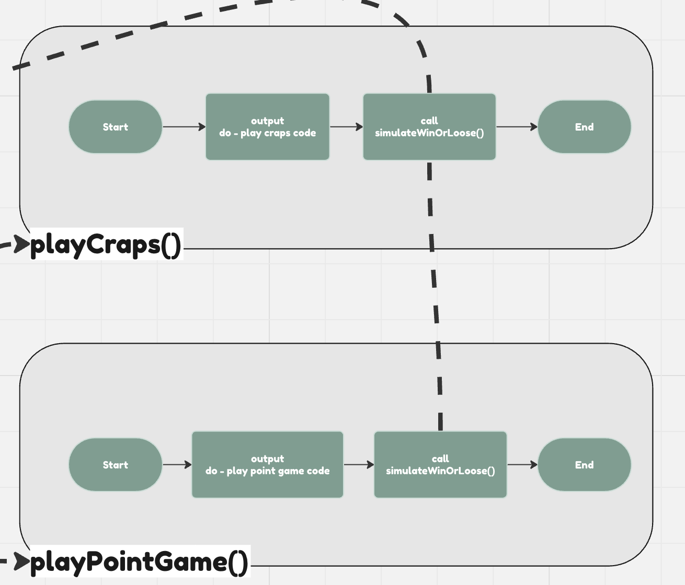
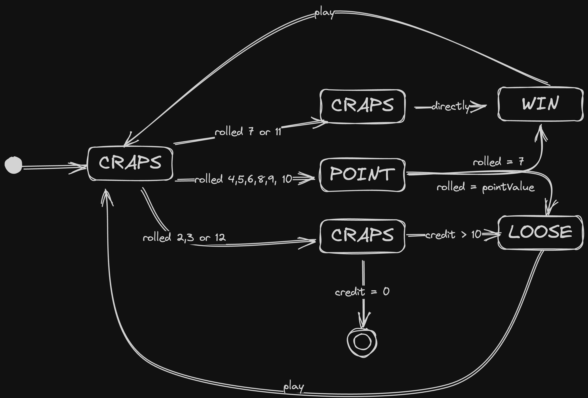
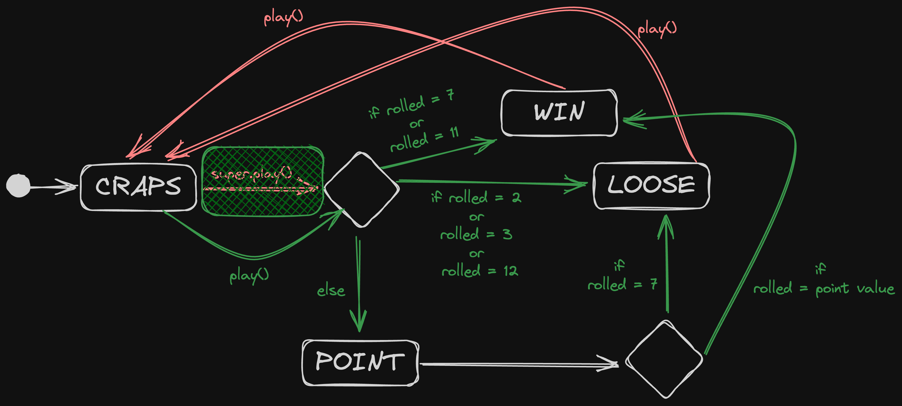

# CA07 Pattern State

## Part 1
> Using the code provided in the Craps00.java example

Provided code
```java
import java.util.Scanner;
import java.util.Random;
/**
****Casino Craps Example Game***
*
*The following code attempts to simulate a Casino Craps game.
*
*Casino Craps (Basic Game) explanation:
*The game of "craps" is commonly played in Casino’s. 
*
*Generally, the game works as follows:
*A player rolls two dice (each with 6 possible values, 1 – 6). After rolling the two dice, 
*the sum of the scores are added. If the sum is 7 or 11 on the first throw, the player wins. 
*
*If the sum is 2, 3 or 12 on the first throw – it is called "craps" and the player loses. 
*
*If the sum is any of the remaining values (4, 5, 6, 8, 9 or 10) this is called the players 
*"point" (or "point-value"). 
*
*Rolling a point-value gives the player a chance to roll again. The player can win the game if they roll 
*their point-value; however, if they roll a 7 first (i.e. before rolling their "point") they lose. 
*
*The player can keep rolling until they roll their "point" (in which case they win), or they 
*roll a 7 (in which case they loose).
*
*
*	NOTE: The following code is only one 'model' of the Casino Craps game.
*		Try not to get trapped-into just this way of thinking about the game. Feel free
*		to re-model (think/describe the game in your own way)
*/
class Main
{
	static boolean firstTime = true;
	static boolean craps	 = false;
	static boolean playPointGame = false;
	static int credits 	 = 10;	//example 10credits to start
	
	public static void main (String[] args)
	{
		//WELCOME
		System.out.println("Welcome");
		
		do{
			askIfLikeToPlay();
			printCredits();
			askPlayerToRoll();
			int rolled = rollDice();
			System.out.println("You rolled: "+rolled);
			checkPlayPointGame( rolled );
			
			if( playPointGame )
			{
				playPointGame();
			}else{
				playCraps();
			}
		
		}while( !craps );
	}
	
	static void playCraps()
	{
		System.out.println("do - play craps code");
		simulateWinOrLoose();
	}
	
	static void playPointGame()
	{
		System.out.println("do - play point game code");
		simulateWinOrLoose();
	}
	
	static void checkPlayPointGame(int rolled)
	{
		if ( rolled == 7 || rolled == 11 || rolled == 2 
				|| rolled == 3 || rolled == 12)
		{
			playPointGame = false;
		
		}else{
			playPointGame = true;
		}
	}
	static int rollDice()
	{
		Random random = new Random();
		int die1 = random.nextInt(6) + 1;
		int die2 = random.nextInt(6) + 1;
		int rolled = die1 + die2;
		return rolled;
	}
	static void printCredits()
	{
		System.out.println("Credits: "+credits);
	}
	
	static void askPlayerToRoll()
	{
		Scanner scanner = new Scanner(System.in);
		System.out.println("Press Enter to Roll");
		String userInput = scanner.nextLine();
		
		if(userInput.equals(""))
		{
			
		}else{
			System.out.println("quitting...");
			System.exit(-1);
		}
	}
	static void askIfLikeToPlay()		//definition
	{
		if( firstTime )
		{
			System.out.println("play");
			firstTime = false;
		}else{
			System.out.println("play again");
		}
	}
	
	static void simulateWinOrLoose(){
		if( Math.random() > .5){
			System.out.println("Simulated Win");
			credits+=5;
		}else{
			System.out.println("Simulated Loose");
			System.out.println("Setting craps to true");
			craps = true; //set craps boolean to true
			System.out.println("game will now end...");
		}
	}
}
```

### Draw a flow chart of the execution of the code provided
* [Flow Chart Link](https://miro.com/app/board/uXjVNXC1cMw=/?share_link_id=862947530755)

### Identify on the diagram exactly where you feel the code is not performing as it should and why

* [Flow Chart Link](https://miro.com/app/board/uXjVNXC1cMw=/?share_link_id=862947530755)



1. Now, `playCraps()` and `playPointGame()` methods call same methods (`simulateWinOrLoose()`)

3. Remove `simulateWinOrLoose()` method calling from the `playCraps()` method. 

    *  `playCraps()` called for winning or losing values (2,3,7,11,12)

    * `simulateWinOrLoose()` called for playing point game

    * We should not call `simulateWinOrLoose()` from the `playCraps()`. Because program output should be different.

### Identify changes to get the code to perform as it should: marks awarded for being as precise as possible

* Create a new action for `playCraps()` instead of `simulateWinOrLoose()`

* `playCraps()` should call `simulateWinOrLoose()` (new action) for decide rolled number value is winning value or not

* `playPointGame()` should call `simulateWinOrLoose()` for playing point game

```java
static void simulateWinOrLoose(){
    if( Math.random() > .5){
        System.out.println("Simulated Win");
        credits+=5;
    }else{
        System.out.println("Simulated Loose");
        System.out.println("Setting craps to true");
        craps = true; //set craps boolean to true
        System.out.println("game will now end...");
    }
}
```

* Call `announceWinOrLoose(rolled)` insted of `simulateWinOrLoose()``

```java
// add rolled paramter to pass the announceWinOrLoose method
static void playCraps(int rolled)
{
    System.out.println("do - play craps code");
    // old code
    // simulateWinOrLoose();

    // new code
    announceWinOrLoose(rolled);
}
```

* Update calling of the playCraps method

```java
if( playPointGame )
    {
        playPointGame();
    }else{
    // old code
    // playCraps();

    // new code
        playCraps(rolled);
}
```

## Part 2
Using the code provided in the Craps01.java

```java
/*
*This work by Rob Cleary is licensed under a Creative Commons AttributionShareAlike
*3.0 Unported License. Based on a work at www.usethetools.net. Permissions beyond
*the scope of this license may be available via usethetoolsinstructor1@gmail.com.
*/
import java.util.*;
class Main{
	public static void main(String[] args){
		GameController game = new GameController();
		game.start();
	}
}
class GameController{
	static Map<String, CrapsGameState> possibleStates = new HashMap<String, CrapsGameState>();
  static CrapsGameState gameState;
	
	GameController(){
		possibleStates.put( "CRAPS", new CrapsState() );
		possibleStates.put( "POINT", new PointState() );
		possibleStates.put( "WIN", new WinState() );
		possibleStates.put( "LOOSE", new LooseState() );
		gameState = possibleStates.get("CRAPS");
	}
	void start(){
		while(true){
			UIHandler.askPlayerToRoll();
			play(Dice.rollDice());//UIHandler.userInputTestRollValue());	
		}
	}
	
  void play(int rolled){
      gameState.play(rolled); //"delegation" to this.gameState.play() (i.e. INITIAL 1st time)
  }
  static void setState(String gameStateName){
      System.out.println("setState( :"+gameStateName+")");
      gameState = getState(gameStateName);
      gameState.doEnterStateActivity();
  }

 static void setState(String gameStateName, int rollValue){
      CrapsGameState passedIn = getState(gameStateName);
      if(passedIn instanceof PointState){
        ((PointState)passedIn).storePointValueAs(rollValue);
      }
      setState(gameStateName);		
  }
	static CrapsGameState getState(String gameStateLookUp){
		return possibleStates.get(gameStateLookUp);
	}
}

abstract class CrapsGameState{
	void play(int rolled){ 
		System.out.println( "CrapsGameState.play()" );
		if( rolled == 7 || rolled == 11){
			GameController.setState("WIN"); 
		
		}else if ( rolled == 2 || rolled == 3 || rolled == 12 ){
			GameController.setState("LOOSE");
		}else {
			GameController.setState("POINT", rolled );
		}			
  }
	
	void doEnterStateActivity(){
		; //default: entry/doNothing
	}
	void doExitStateActivity(){
		; //default: entry/doNothing
	}
	
	public String toString(){
		return this.getClass().getSimpleName();
	}
}

class CrapsState extends CrapsGameState{
	void play(int rolled){ 
		System.out.println( "CrapsState.play() - calling on..." );
		super.play(rolled);
  }
}

class WinState extends CrapsGameState{
    
	void play(int rolled){ 
		System.out.println( "WinState.play()"+rolled );
		System.out.println( "increase credits");
		GameController.setState("CRAPS");
  }
}

class LooseState extends CrapsGameState{
    
	void play(int rolled){ 
		System.out.println( "LooseState.play() - rolled: "+rolled );
		System.out.println( "decrease credits");
		GameController.setState("CRAPS");
  }
}
class PointState extends CrapsGameState{
    
	int pointValue;
	
	void play(int rolled){
		System.out.println( "PointState.play()");
		if( rolled == pointValue ){
			resetPointValue();
			GameController.setState("WIN");
		}else if( rolled == 7 ){
			resetPointValue();
			GameController.setState("LOOSE");
		}else{
			; //do nothing
		}			
    }
	
	void storePointValueAs(int rolled){
		pointValue = rolled;
	}
	void resetPointValue(){
		pointValue = 0;
	}
}

class Dice{
	static int rollDice()
	{
		Random random = new Random();
		int die1 = random.nextInt(6) + 1;
		int die2 = random.nextInt(6) + 1;
		int rolled = die1 + die2;
		System.out.println("...rolled: "+rolled);
		return rolled;
	}
}
class UIHandler{
	static void askPlayerToRoll(){
		String userInput = getUserInput("Press Enter to Roll");
		
		if(userInput.equals("")){
			
		}else{
			System.out.println("quitting...");
			System.exit(-1);
		}
	}
  
	static String getUserInput(String msg){
		Scanner scanner = new Scanner(System.in);
		System.out.println(msg);
		return scanner.nextLine();
	}
	static int userInputTestRollValue(){
		String userInput = UIHandler.getUserInput("Enter a number between 2 and 12 to test");
		return Integer.parseInt(userInput);
	}
}
```

### Draw a UML state-diagram


###  Identify on the diagram exactly where you feel the code is not performing as it should and why



### Identify changes to get the code to perform as it should: marks awarded for being as precise as possible

* Update `play(int rolled)` method as an abstract method

class CrapsGameState

```java
// old code
void play(int rolled){ 
		System.out.println( "CrapsGameState.play()" );
		if( rolled == 7 || rolled == 11){
			GameController.setState("WIN"); 
		
		}else if ( rolled == 2 || rolled == 3 || rolled == 12 ){
			GameController.setState("LOOSE");
		}else {
			GameController.setState("POINT", rolled );
		}			
  }

// new code
abstract void play(int rolled);
```

* Transfer action logic from the CrapsGameState class' s `play(into rolled)` method into the Craps State class' `play(into rolled)` method

```java
// old code
class CrapsState extends CrapsGameState{
	void play(int rolled){ 
		System.out.println( "CrapsState.play() - calling on..." );
		super.play(rolled);
  }
}

// new code
class CrapsState extends CrapsGameState {
    void play(int rolled) {
        System.out.println("CrapsState.play() - calling on...");
        if (rolled == 7 || rolled == 11) {
            GameController.setState("WIN");

        } else if (rolled == 2 || rolled == 3 || rolled == 12) {
            GameController.setState("LOOSE");
        } else {
            GameController.setState("POINT", rolled);
        }
    }
}
```