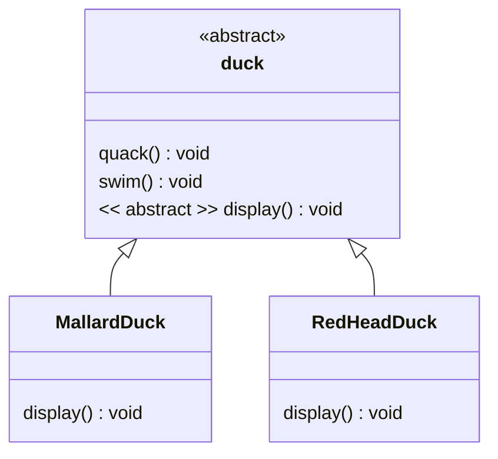
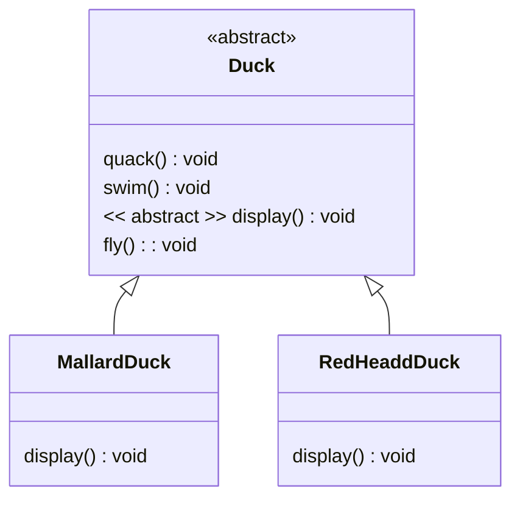
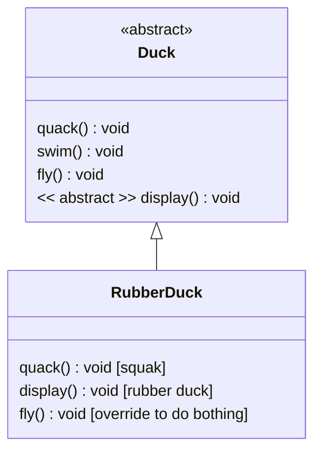
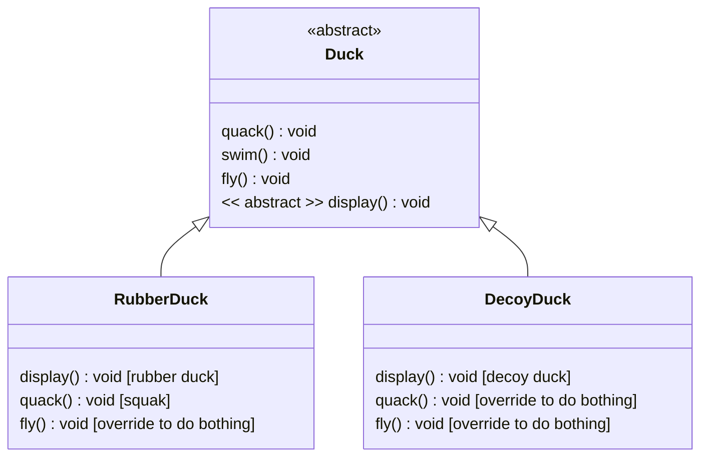
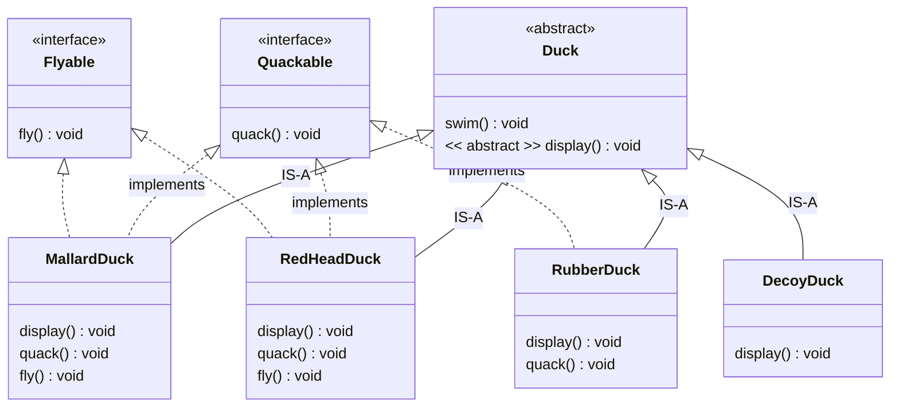
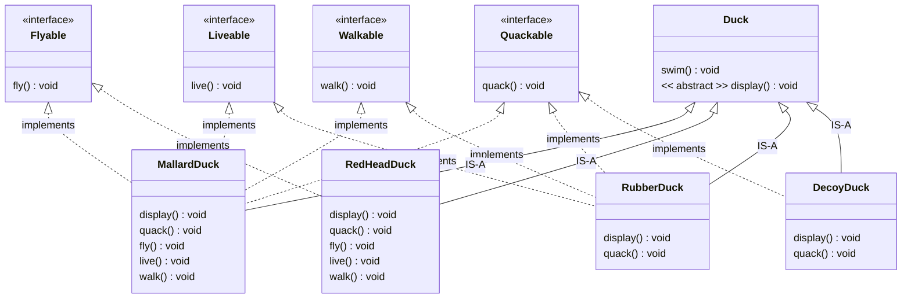
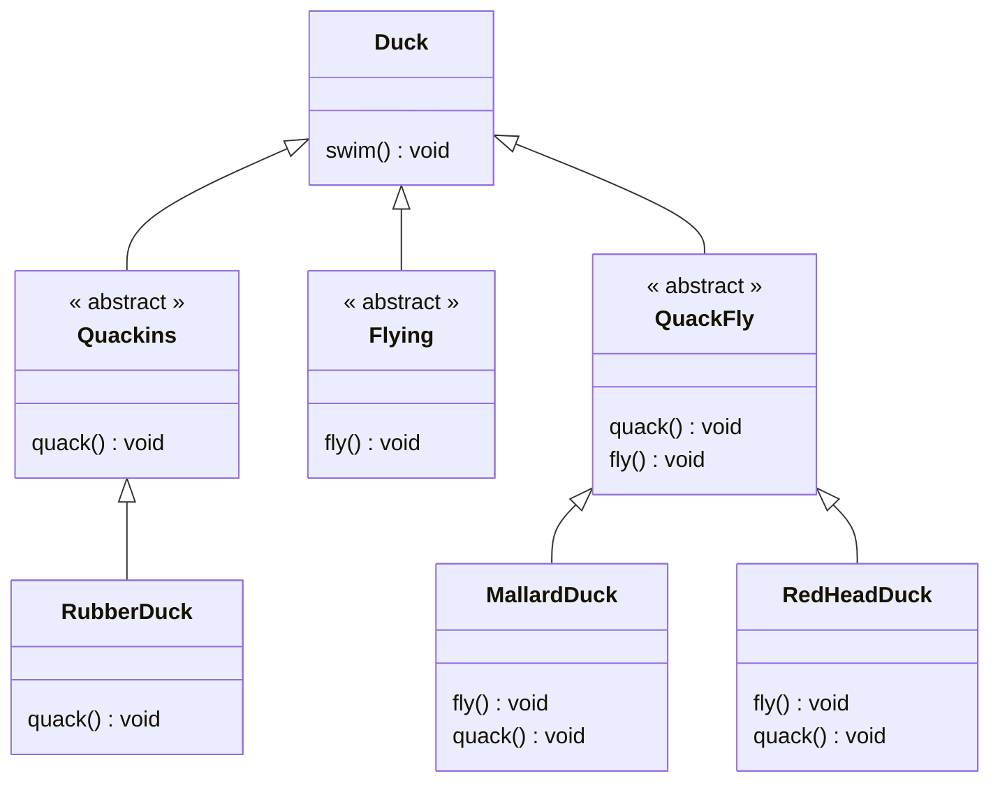
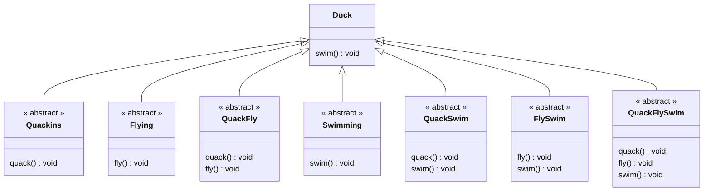
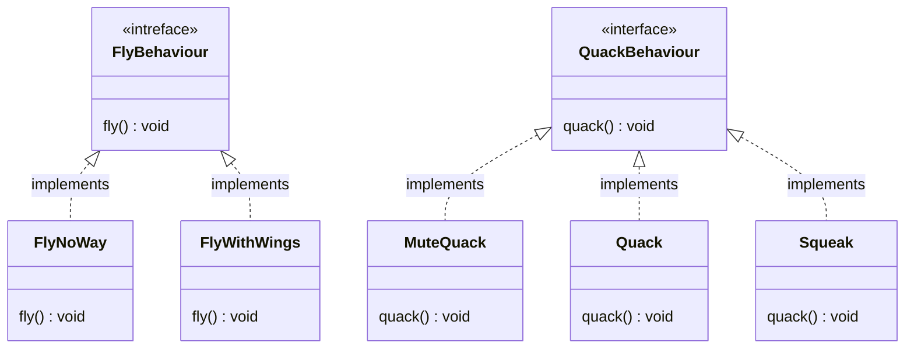
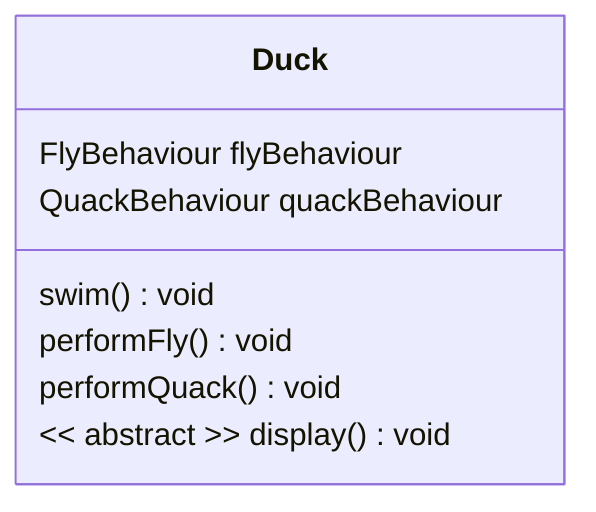

# Strategy Design Pattern

## Initial Situation
"SimUDuck" game can show a large variety of duck species swimming and making quacking sounds. One Duck superclass from which all other duck types inherit. 



```java
// Duck.java
abstract class Duck {
    abstract void display();
    
    void quack(){
        System.out.println("Default Quack");
    }

    void swim(){
        System.out.println("Default Swim");
    }
}

// MallardDuck.java
class MallardDuck extends Duck {
    
    @Override
    void display(){
        System.out.println("A Mallard Duck");
    }
}

// RedHeadDuck.java
class RedHeadDuck extends Duck {
     
    @Override
    void display(){
        System.out.println("A Red Head Duck");
    }
}
```

## Now we need the ducks to FLY

> I just need to add a fly() method in the Duck class 
and then all the ducks will inherit it.



```java
// Duck.java
abstract class Duck {
    abstract void display();
    
    void quack(){
        System.out.println("Default Quack");
    }

    void swim(){
        System.out.println("Default Swim");
    }

    // !!!!!!!!!!!!!!!!!!!!!!!! FRESH LINES !!!!!!!!!!!!!!!!!!!!!!!!
    void fly(){
        System.out.println("Default Fly");
    }
    // !!!!!!!!!!!!!!!!!!!!!!!! FRESH LINES !!!!!!!!!!!!!!!!!!!!!!!!
}

// MallardDuck.java
class MallardDuck extends Duck {
    
    @Override
    void display(){
        System.out.println("A Mallard Duck");
    }
}

// RedHeadDuck.java
class RedHeadDuck extends Duck {
     
    @Override
    void display(){
        System.out.println("A Red Head Duck");
    }
}
```

### Bullet Points

* All subclasses inherit fly().

### Pain Points

* By putting `fly()` in the superclass, he gave flying ability to ALL ducks, including those that shouldn’t.

```java
RedHeadDuck duck = new RedHeadDuck();
duck.fly(); // It works

MallardDuck duck_2 = new MallardDuck();
duck_2.fly(); // It works
```

* When we added new behavior to the Duck superclass, we was also adding behavior that was not appropriate for some Duck subclasses. For example: Rubber Duck. We now has flying inanimate objects in the program.


```java
RubberDuck duck = new RubberDuck();
duck.fly(); // It works
```


## How to Fix It?

## First Attmempt: Inheritance

> I could always just override the fly() method in rubber duck, the way I am with the quack() method.



```java
// Duck.java
class Duck {
    abstract void display();
    
    void quack(){
        System.out.println("Default Quack");
    }

    void swim(){
        System.out.println("Default Swim");
    }
    
    void fly(){
        System.out.println("Default Fly");
    }
}

// RubberDuck.java
class RubberDuck extends Duck {
    @Override
    void display() {
        System.out.println("A Rubber Duck");
    }

    @Override
    void quack(){
        System.out.println("Speacial Quack For Rubber Duck");
    }

    // !!!!!!!!!!!!!!!!!!!!!!!! FRESH LINES !!!!!!!!!!!!!!!!!!!!!!!!
    @Override
    void fly(){
        System.out.println("Do nothing !");
    }
    // !!!!!!!!!!!!!!!!!!!!!!!! FRESH LINES !!!!!!!!!!!!!!!!!!!!!!!!
}
```

### Pain Points

What are the negatives/drawbacks with the approach to override a method to do nothing?

* When we add wooden `decoy ducks` to the program? They aren’t supposed to `fly` or `quack`.



* Above diagram causes code repetations

    * The body of the `fly()` method is the same for both classes and 
    we have to define same methods in different classes.

    ```java
    class RubberDuck extends Duck {
        // SAME METHOD WITH DECOYDUCK
        @Override
        void fly(){
            System.out.println("Do nothing !");
        }

        @Override
        void display(){
            System.out.println("RubberDuck");
        }
    }

    class DecoyDuck extends Duck {
        // SAME METHOD WITH RUBBERDUCK
        @Override
        void fly(){
            System.out.println("Do nothing !");
        }

        @Override
        void display(){
            System.out.println("DecoyDuck");
        }
    }
    ```
    
    * Also, count of the repetations might be increase as well.

        * if we add three new methods `live`, `coupling` and `walk`, we have to write doing nothing methods in `RubberDuck` and `DecoyDuck`.

        ```mermaid
        classDiagram
        class RubberDuck {
            quck() void [squak]
            display() void [rubber duck]
            fly() void [override to do bothing]
            live() void [override to do bothing]
            coupling() void [override to do bothing]  
            walk() void [override to do bothing]
        }

        class DecoyDuck {
            display() void [decoy duck]
            quck() void [override to do bothing]  
            fly() void [override to do bothing]  
            live() void [override to do bothing]
            coupling() void [override to do bothing]
            walk() void [override to do bothing]
        }
        ```

        ```java
        class RubberDuck extends Duck {
            // SAME METHOD
            @Override
            void fly(){
                System.out.println("Do nothing !");
            }

            // SAME METHOD
            @Override
            void live(){
                System.out.println("Do nothing !");
            }

            // SAME METHOD
            @Override
            void coupling(){
                System.out.println("Do nothing !");
            }

            // SAME METHOD
            @Override
            void walk(){
                System.out.println("Do nothing !");
            }

            @Override
            void display(){
                System.out.println("RubberDuck");
            }
        }

        class DecoyDuck extends Duck {
            // SAME METHOD
            @Override
            void fly(){
                System.out.println("Do nothing !");
            }

            // SAME METHOD
            @Override
            void live(){
                System.out.println("Do nothing !");
            }

            // SAME METHOD
            @Override
            void coupling(){
                System.out.println("Do nothing !");
            }

            // SAME METHOD
            @Override
            void walk(){
                System.out.println("Do nothing !");
            }

            @Override
            void display(){
                System.out.println("DecoyDuck");
            }
        }
        ```

* Calculation of code repetations

> `Total Repetation` = `N` x `M`

> `N` : Number of the classes that hold same overrided methods

> `M` : Number of the behaviours that must be overrided for doing nothing

> `Total Repetation` = (RubberDuck + DecoyDuck) x (fly + live + coupling + walk)

> `Total Repetation` = 2 x 4

* Suppose our client wanted a unique feature for Halloween week that allows all our characters (ducks) to fly in the game. 

    * We have to update all overrided methods. (N X M)

* Suppose we come across a priority bug in fly behavior during Halloween. Then, we have to edit all fly methods. (N x M)

## Second Attempt: Interface

> I could take the fly() out of the Duck superclass, and make a
Flyable() interface with a fly() method. That way, only the ducks that are supposed to fly will implement that interface and 
have a fly() method. Also, I might as well make a Quackable, too, since not all ducks can quack.



```java
// Flyable.java
interface Flyable {
    void fly();
}

// Quackable.java
interface Quackable {
    void fly();
}

// Duck.java
abstract class Duck {
    abstract void display();

    void swim(){
        System.out.println("Default swim");
    }
}

// DecoyDuck.java
class DecoyDuck extends Duck{
    @Override
    void display() {
        System.out.println("Decoy Duck");
    }
}

// RubberDuck.java
class RubberDuck extends Duck implements Quackable{
    @Override
    void display() {
        System.out.println("Rubber Duck");
    }

    void quack() {
        System.out.println("Quack Rubber Duck");
    }
}

// RedHeadDuck.java
class RedHeadDuck extends Duck implements Quackable, Flyable {
    @Override
    void display() {
        System.out.println("RedHead Duck");
    }

    void quack() {
        System.out.println("Quack RedHead Duck");
    }

    void fly(){
        System.out.println("Fly With Wings");
    }
}

// MallardDuck.java
class MallardDuck extends Duck implements Quackable, Flyable {
    @Override
    void display() {
        System.out.println("Mallard Duck");
    }

    void quack() {
        System.out.println("Quack Mallard Duck");
    }

    void fly(){
        System.out.println("Fly With Wings");
    }
}
```

## Pain Points

What design issue results from trying to replace inheritance with the use of interfaces?

* Above diagram causes code repetations

    * We have to apply the same implementation of interface methods in different classes. 

    * For example, `fly()`method has same body for `MallardDuck` and `RedHeadDuck` classes.

    ```java
    // RedHeadDuck.java
    class RedHeadDuck extends Duck implements Quackable, Flyable {
        
        // SAME METHOD !!!!!
        void fly(){
            System.out.println("Fly With Wings");
        }
    }

    // MallardDuck.java
    class MallardDuck extends Duck implements Quackable, Flyable {
        
        // SAME METHOD !!!!!
        void fly(){
            System.out.println("Fly With Wings");
        }
    }
    ```

    ```java
        RedHeadDuck duck = new RedHeadDuck();
        MallardDuck duck_2 = new MallardDuck();

        duck.fly();         // #=> Fly With Wings
        duck_1.fly();       // #=> Fly With Wings
    ```

* Difficult Maintenance

    * Suppose we come priority bug in fly behavior. Then, we have to edit all fly methods.

    ```java
    // RedHeadDuck.java
    class RedHeadDuck extends Duck implements Quackable, Flyable {
        
        // NEW SAME METHOD !!!!!
        void fly(){
            System.out.println("New Fly With Wings");
        }
    }

    // MallardDuck.java
    class MallardDuck extends Duck implements Quackable, Flyable {
        
        // NEW SAME METHOD !!!!!
        void fly(){
            System.out.println("New Fly With Wings");
        }
    }
    ```

    ```java
        RedHeadDuck duck = new RedHeadDuck();
        MallardDuck duck_2 = new MallardDuck();

        duck.fly();         // #=> New Fly With Wings
        duck_1.fly();       // #=> New Fly With Wings
    ```

* Also, count of the repetations might be increase as well.

    * If we Add two new interfaces `Liveable`, `Walkable`, we have to write same methods in `MallardDuck` and `RedHeadDuck` classes.

<u> If class diagram looks complicated, you can review the DSL with viewing md file source</u>



```java
// Flyable.java
interface Flyable {
    void fly();
}

// Quackable.java
interface Quackable {
    void fly();
}

// !!!!!!!!!!!!!!!!!!!!!!!! FRESH LINES !!!!!!!!!!!!!!!!!!!!!!!!
// Walkable.java
interface Walkable {
    void walk();
}

// Liveable.java
interface Liveable {
    void live();
}
// !!!!!!!!!!!!!!!!!!!!!!!! FRESH LINES !!!!!!!!!!!!!!!!!!!!!!!!

// Duck.java
class Duck {
    abstract void display();

    void swim(){
        System.out.println("Default swim");
    }
}

// DecoyDuck.java
class DecoyDuck extends Duck{
    @Override
    void display() {
        System.out.println("Decoy Duck");
    }
}

// RubberDuck.java
class RubberDuck extends Duck implements Quackable{
    @Override
    void display() {
        System.out.println("Rubber Duck");
    }

    void quack() {
        System.out.println("Quack Rubber Duck");
    }
}

// RedHeadDuck.java
// !!!!!!!!!!!!!!!!!!!!!!!! FRESH LINES !!!!!!!!!!!!!!!!!!!!!!!!
class RedHeadDuck extends Duck implements Quackable, Flyable, Walkable, Liveable {
// !!!!!!!!!!!!!!!!!!!!!!!! FRESH LINES !!!!!!!!!!!!!!!!!!!!!!!!

    @Override
    void display() {
        System.out.println("RedHead Duck");
    }

    void quack() {
        System.out.println("Quack RedHead Duck");
    }

    void fly(){
        System.out.println("Fly With Wings");
    }

// !!!!!!!!!!!!!!!!!!!!!!!! FRESH LINES !!!!!!!!!!!!!!!!!!!!!!!!
    void live(){
        System.out.println("Alive");
    }

    void walk(){
        System.out.println("Walk With Foot");
    }
// !!!!!!!!!!!!!!!!!!!!!!!! FRESH LINES !!!!!!!!!!!!!!!!!!!!!!!!
}

// MallardDuck.java
// !!!!!!!!!!!!!!!!!!!!!!!! FRESH LINES !!!!!!!!!!!!!!!!!!!!!!!!
class MallardDuck extends Duck implements Quackable, Flyable, Walkable, Liveable {
// !!!!!!!!!!!!!!!!!!!!!!!! FRESH LINES !!!!!!!!!!!!!!!!!!!!!!!!

    @Override
    void display() {
        System.out.println("Mallard Duck");
    }

    void quack() {
        System.out.println("Quack Mallard Duck");
    }

    void fly(){
        System.out.println("Fly With Wings");
    }

    // !!!!!!!!!!!!!!!!!!!!!!!! FRESH LINES !!!!!!!!!!!!!!!!!!!!!!!!
    void live(){
        System.out.println("Alive");
    }

    void walk(){
        System.out.println("Walk With Foot");
    }
// !!!!!!!!!!!!!!!!!!!!!!!! FRESH LINES !!!!!!!!!!!!!!!!!!!!!!!!
}
```

* Calculation of code repetations

> `Total Repetation` = `N` x `M`

> `N` : Number of the interface methods that hold behaviour

> `M` : Number of the classes that must be implement behaviours

> `Total Repetation` =  (quack + fly + live + walk) x (MallardDuck + RedHeadDuck)

> `Total Repetation` = 4 x 2

## Attempt Thirth: sub-classes for specific behaviours
> An approach to create specific sub-classes for each specific behaviour



```java
    // Duck.java
    class Duck {
        void swim() {
            System.out.println("Default swim");
        }
    }

    // Quackins.java
    abstract class Quackins {
        void quack();
    }

    // Flying.java
    abstract class Flying {
        void fly();
    }

    // QuackFly.java
    abstract class QuackFly {
        void quack();
        void fly();
    }

    // RubberDuck.java
    class RubberDuck extends Quackins {
        @Override
        void quack() {
            System.out.println("Quack Rubber Duck");
        }
    }

    // MallardDuck.java
    class MallardDuck extends QuackFly {
        @Override
        void fly(){
            System.out.println("Fly with wings");
        }

        @Override
        void quack(){
            System.out.println("Quack Mallard Duck");
        }
    }

    // RedHeadDuck.java
    class RedHeadDuck extends QuackFly {
        @Override
        void fly(){
            System.out.println("Fly with wings");
        }

        @Override
        void quack(){
            System.out.println("Quack RedHead Duck");
        }
    }
```

### Pain Points
What are the drawbacks/negatives with the approach to create specific sub-classes for specific behaviours?

* Creating too many classes
    * if you have two behaviours, you have to create three behavior class
    
    ```yaml
        Behaviours: Quack, Fly
        Behaviour Classes:  Quack, Fly, QuckFly
    ```

    * if you have three behaviours, you have to create seven behavior class
    
    ```yaml
        Behaviours: Quack, Fly, Swim
        Behaviour Classes:  Quack, Fly, Swim, QuckFly, QuickSwim, FlySwim, QuackFlySwim
    ```



* General formula for calculation is 2^n - 1, n: number of the behaviours

* if you have four behaviours, you have to create fifteen behavior class (2^4 - 1 = 15)

* If a set contains ‘n’ elements, then the number of subsets of the set is 2^n

* If a set contains ‘n’ elements, then the number of proper subsets of the set is 2^ - 1
 
* Tight coupling 

    * In the above diagram, behaviours are closely connected to duck class.

    * If we want to add fly behaviour to another animal, we have to create similar behavior classes for that animal.

## Attempt Fourth: Strategy Design Pattern

> Take the parts that vary and encapsulate them, 
so that later you can alter or extend the parts that vary without affecting those that don’t.

> Program to an interface, not an implementation.

We’ll use an interface to represent each behavior – for instance, FlyBehavior and QuackBehavior – and each implementation of a behavior will implement one of those interfaces.
So this time it won’t be the Duck classes that will implement the flying and quacking interfaces. Instead, we’ll make a set of classes whose entire reason for living is to represent a behavior (for example,
“squeaking”), and it’s the behavior class, rather than the Duck class, that will implement the behavior interface.

### Implementing the Duck Behaviors



<br>

* With this design, other types of objects can reuse our fly and quack behaviors because these behaviors are no longer hidden away in our Duck classes!
And we can add new behaviors without modifying any of our existing behavior classes or touching any of the Duck classes that use flying behaviors.

* With this design, other types of objects can reuse our fly and quack behaviors because these behaviors are no longer hidden away in our Duck classes!
And we can add new behaviors without modifying any of our existing behavior classes or touching any of the Duck classes that use flying behaviors.

### Integrating the Duck Behavior

The key is that a Duck will now delegate its flying
and quacking behavior, instead of using quacking and flying methods defined in the Duck class (or subclass).


<br>


The Strategy Pattern defines a family of algorithms, encapsulates each one, and makes them interchangeable. Strategy lets the algorithm vary independently from clients that use it.

[Implementation Link](https://replit.com/@AtaGunay/Strategy-Design-Pattern)

```java
abstract class Duck {
  // We need fly & quack behaviour for some duck types
  FlyBehaviour flyBehaviour;
  QuackBehaviour quackBehaviour;

  // An example of encapsulation
  // We can change the behaviour in runtime
  void setFlyBehaviour(FlyBehaviour flyBehaviour){
    this.flyBehaviour = flyBehaviour;
  }

  // An example of encapsulation
  // We can change the behaviour in runtime
  void setQuackBehaviour(QuackBehaviour quackBehaviour){
    this.quackBehaviour = quackBehaviour;
  }

  // For using fly method because base class can not reach sub class methods
  void performFly(){
    flyBehaviour.fly();
  }

  // For using fly method because base class can not reach sub class methods
  void performQuack(){
    quackBehaviour.quack();
  }
  
  // abstract method
  // it must be overrided by the subclasses
  abstract void display();
  
  void swim() {
    System.out.println("Default swim for duck");
  }
}

// Sub Class
class RubberDuck extends Duck {
  @Override
  void display() {
      System.out.println("Rubber Duck");
  }
}

// Sub Class
class DecoyDuck extends Duck {
  @Override
  void display() {
      System.out.println("Rubber Duck");
  }
}

// Sub Class
class MallardDuck extends Duck {
  @Override
  void display() {
      System.out.println("MallardDuck");
  }
}

// Program to interfaces, not implementations.
interface FlyBehaviour {
  public void fly();
}

// Algorithm or Behaviour
class FlyWithWings implements FlyBehaviour{
  public void fly(){
    System.out.println("Fly with wings");
  }
}

// Algorithm or Behaviour
class FlyNoWay implements FlyBehaviour{
  public void fly(){
    System.out.println("Can not fly");
  }
}

// Program to interfaces, not implementations.
interface QuackBehaviour {
  public void quack();
}

// Algorithm or Behaviour
class Quack implements QuackBehaviour {
  public void quack(){
      System.out.println("Quack !!!!");
  }
}

// Algorithm or Behaviour
class Squeak implements QuackBehaviour {
  public void quack(){
      System.out.println("Squeak !!!!");
  }
}

// Algorithm or Behaviour
class QuackMute implements QuackBehaviour {
  public void quack() {
    System.out.println("Silence");
  }
}

// Main
class Main {
  public static void main(String[] args) {
    System.out.println("Creating a rubber duck...");
    Duck rubber = new RubberDuck();

    System.out.println("Setting quack behaviour for rubber duck...");
    rubber.setQuackBehaviour(new Squeak());

    System.out.println("Setting fly behaviour for rubber duck...");
    rubber.setFlyBehaviour(new FlyNoWay());

    System.out.println("A rubber duck: ");
    rubber.performFly();
    rubber.performQuack(); 

    System.out.println("Changing quack behaviour in runtime...");
    rubber.setQuackBehaviour(new QuackMute());

    System.out.println("A rubber duck: ");
    rubber.performFly();
    rubber.performQuack(); 

    System.out.println("----------------------------------------------");

    System.out.println("Creating a mallard duck...");
    Duck mallard = new RubberDuck();

    System.out.println("Setting quack behaviour for mallard duck...");
    mallard.setQuackBehaviour(new Quack());

    System.out.println("Setting fly behaviour for mallard duck...");
    mallard.setFlyBehaviour(new FlyWithWings());

    System.out.println("A mallard duck: ");
    mallard.performFly();
    mallard.performQuack(); 

    System.out.println("Changing fly behaviour in runtime...");
    mallard.setFlyBehaviour(new FlyNoWay());

    System.out.println("A mallard duck: ");
    mallard.performFly();
    mallard.performQuack(); 
  }
}
```
