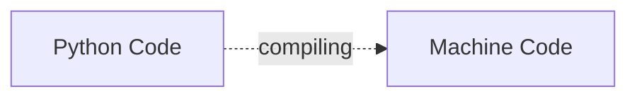

# Week 1

## What Does A Compiler Do?

> In general, computer programs exist in High-Level Language that a human being can easily understand. But computers cannot understand the same high-level language, so for computers, we have to convert them into machine language and make them readable for computers.


 The process of transformation is called compilation.

## Compiler vs. Interpreter

> Both compiler and interpreters do the same job which is converting higher level programming language to machine code.

| Compiler   | Interpreter |
| --------   | ----------- |
| A compiler will convert the code into machine code (create an exe) before program run | Interpreters convert code into machine code when the program is run |


## Analysis and Synthesis

> There are two parts to compilation: analysis and synthesis.

1. Analysis (Frontend)
    * Reads the source program and splits it into multiple tokens and constructs the intermediate representation of the source program.

    * Checks and indicates the syntax and semantic errors of a source program.

    * Steps
        1. Lexical analysis
        2. Syntactic analysis
        3. Semantic analysis

2. Synthesis (Backend)

    * It will get the analysis phase input(intermediate representation and symbol table) and produces the targeted machine level code.

    * Steps
        1. optimisation
        2. code generation

```mermaid
    flowchart LR
    indermediate[Intermediate Representation] --> machine[Machine Code]
    source --> indermediate

    subgraph Frontend
        indermediate
    end

    subgraph Backend
        machine
    end
``````

## What is Assembly?

> Assembly is one level up from machine language. Each statement
corresponds to a single machine code instruction.

> From assembly language to binary code is done via an assembler.

```assembly
    movl = 1000
    $0=0000
    %eax=01001
    movl $0 %eax=1000000001001
``````
